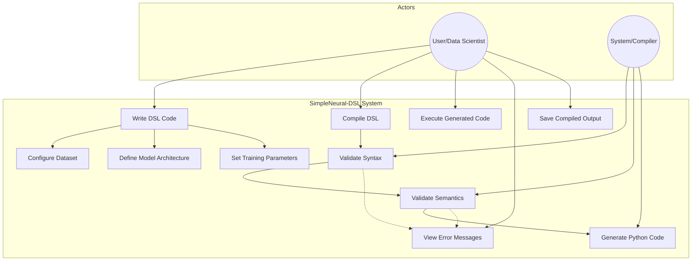
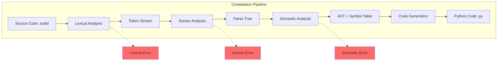
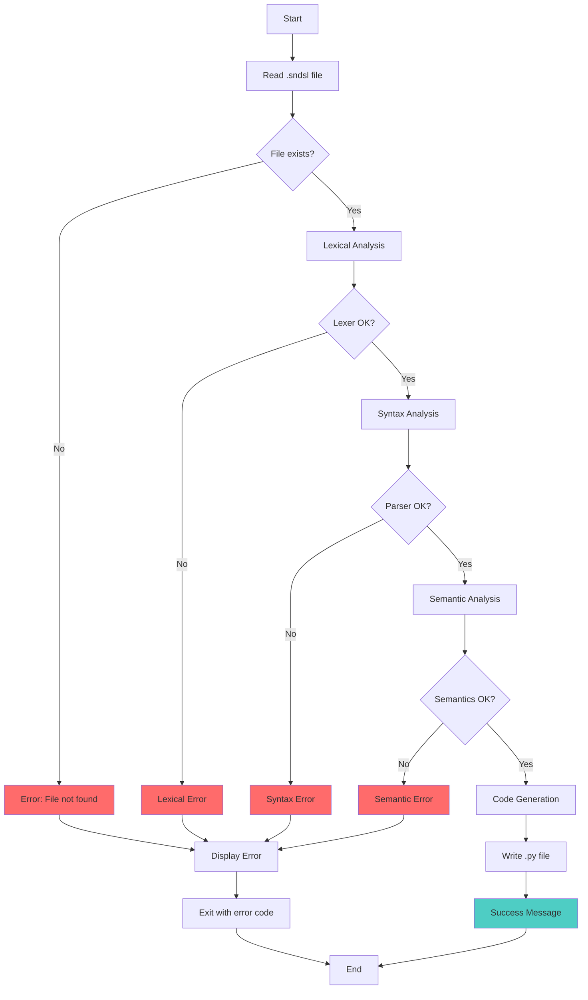
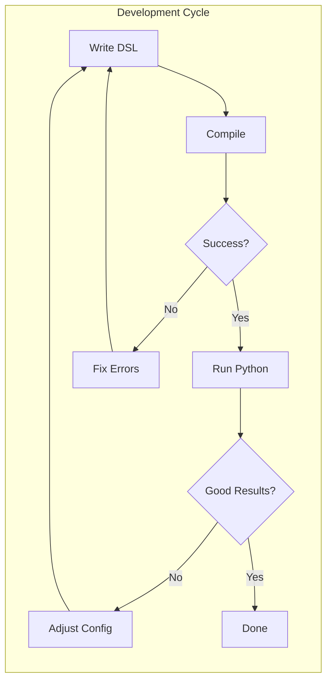

# SimpleNeural-DSL: Use Case Analysis

## 4. Diagram Use Case

### 4.1 Use Case Diagram



### 4.2 Use Case Diagram (Detail - Kompilasi)



---

## 5. Spesifikasi Use Case

### 5.1 UC-01: Write DSL Code

| Atribut           | Deskripsi                                                         |
| ----------------- | ----------------------------------------------------------------- |
| **Use Case ID**   | UC-01                                                             |
| **Use Case Name** | Write DSL Code                                                    |
| **Actor(s)**      | User (Data Scientist, ML Engineer, Student)                       |
| **Description**   | Pengguna menulis kode konfigurasi ML menggunakan SimpleNeural-DSL |
| **Trigger**       | Pengguna membuka text editor untuk membuat file .sndsl            |

**Preconditions:**

1. Pengguna memiliki text editor yang tersedia
2. Pengguna memahami sintaks dasar SimpleNeural-DSL

**Main Flow:**
| Step | Action |
|------|--------|
| 1 | Pengguna membuat file baru dengan ekstensi `.sndsl` |
| 2 | Pengguna menulis blok `DATASET` untuk konfigurasi data |
| 3 | Pengguna menulis blok `MODEL` untuk arsitektur |
| 4 | Pengguna menambahkan `LAYER` sesuai kebutuhan |
| 5 | Pengguna menentukan `OPTIMIZER` dan `TRAIN` config |
| 6 | Pengguna menyimpan file |

**Alternative Flows:**
| Alt | Condition | Action |
|-----|-----------|--------|
| 2a | Pengguna menggunakan template | Load template dari contoh yang tersedia |
| 4a | Pengguna perlu layer khusus | Tambahkan parameter custom ke LAYER |

**Postconditions:**

1. File `.sndsl` tersimpan dengan konfigurasi yang valid
2. File siap untuk dikompilasi

**Exception Flows:**
| Exception | Handling |
|-----------|----------|
| Disk full | Tampilkan pesan error dan saran untuk membersihkan disk |
| Permission denied | Tampilkan pesan untuk memeriksa izin direktori |

---

### 5.2 UC-02: Compile DSL

| Atribut           | Deskripsi                                                        |
| ----------------- | ---------------------------------------------------------------- |
| **Use Case ID**   | UC-02                                                            |
| **Use Case Name** | Compile DSL                                                      |
| **Actor(s)**      | User, System                                                     |
| **Description**   | Sistem mengompilasi kode DSL menjadi Python                      |
| **Trigger**       | Pengguna menjalankan command `simpleneural compile <file.sndsl>` |

**Preconditions:**

1. File `.sndsl` ada dan dapat dibaca
2. SimpleNeural compiler terinstal

**Main Flow:**
| Step | Actor | Action |
|------|-------|--------|
| 1 | User | Menjalankan command compile |
| 2 | System | Membaca file source |
| 3 | System | Menjalankan Lexical Analysis |
| 4 | System | Menjalankan Syntax Analysis |
| 5 | System | Menjalankan Semantic Analysis |
| 6 | System | Generate Python code |
| 7 | System | Menulis output ke file `.py` |
| 8 | User | Menerima konfirmasi sukses |

**Alternative Flows:**
| Alt | Condition | Action |
|-----|-----------|--------|
| 3a | Lexical error ditemukan | Hentikan, tampilkan error (UC-07) |
| 4a | Syntax error ditemukan | Hentikan, tampilkan error (UC-07) |
| 5a | Semantic error ditemukan | Hentikan, tampilkan error (UC-07) |
| 7a | Custom output path | Simpan ke path yang ditentukan |

**Postconditions:**

1. File Python berhasil digenerate
2. Kode Python valid dan dapat dieksekusi

**Exception Flows:**
| Exception | Handling |
|-----------|----------|
| File not found | Error: "File '<filename>' tidak ditemukan" |
| Invalid encoding | Error: "File harus dalam format UTF-8" |
| Output write error | Error: "Gagal menulis output, periksa izin direktori" |

---

### 5.3 UC-03: Validate Syntax

| Atribut           | Deskripsi                                       |
| ----------------- | ----------------------------------------------- |
| **Use Case ID**   | UC-03                                           |
| **Use Case Name** | Validate Syntax                                 |
| **Actor(s)**      | System (internal)                               |
| **Description**   | Parser memvalidasi struktur kode sesuai grammar |
| **Trigger**       | Dipanggil oleh UC-02 setelah lexing             |

**Preconditions:**

1. Token stream tersedia dari lexer
2. Grammar rules telah didefinisikan

**Main Flow:**
| Step | Action |
|------|--------|
| 1 | Terima token stream dari lexer |
| 2 | Inisialisasi parser dengan grammar CFG |
| 3 | Parse token menggunakan recursive descent |
| 4 | Bangun parse tree dari token yang valid |
| 5 | Return parse tree ke semantic analyzer |

**Validation Rules:**

```
Rule 1: Program ::= DatasetDecl ModelDecl+
Rule 2: DatasetDecl ::= DATASET LOAD STRING TARGET STRING
Rule 3: ModelDecl ::= MODEL STRING LBRACE LayerList OptimizerDecl TrainDecl RBRACE
Rule 4: LayerList ::= LayerDecl+
Rule 5: LayerDecl ::= LAYER LAYERTYPE LayerParams
Rule 6: LayerParams ::= (IDENTIFIER COLON VALUE)+
```

**Postconditions:**

1. Parse tree berhasil dibangun, ATAU
2. Syntax error dilaporkan dengan informasi posisi

---

### 5.4 UC-04: Validate Semantics

| Atribut           | Deskripsi                                    |
| ----------------- | -------------------------------------------- |
| **Use Case ID**   | UC-04                                        |
| **Use Case Name** | Validate Semantics                           |
| **Actor(s)**      | System (internal)                            |
| **Description**   | Memeriksa kebenaran logika dan makna program |
| **Trigger**       | Dipanggil setelah syntax validation berhasil |

**Preconditions:**

1. Parse tree tersedia
2. Type rules didefinisikan

**Main Flow:**
| Step | Action |
|------|--------|
| 1 | Traverse parse tree |
| 2 | Bangun symbol table |
| 3 | Validasi tipe data setiap parameter |
| 4 | Validasi layer compatibility |
| 5 | Validasi referensi (dataset, optimizer) |
| 6 | Generate AST yang telah tervalidasi |

**Semantic Checks:**

| Check            | Rule               | Error Message                                                        |
| ---------------- | ------------------ | -------------------------------------------------------------------- |
| Type Check       | `lr` harus float   | "Learning rate harus berupa angka desimal"                           |
| Range Check      | `units > 0`        | "Jumlah units harus positif"                                         |
| Reference Check  | Dataset harus ada  | "Dataset 'X' belum didefinisikan"                                    |
| Compatibility    | Layer dims match   | "Dimensi output layer 1 tidak cocok dengan input layer 2"            |
| Activation Valid | Dalam allowed list | "Activation 'X' tidak dikenal. Pilihan: relu, sigmoid, tanh, linear" |

**Postconditions:**

1. AST valid dan symbol table lengkap, ATAU
2. Semantic error dengan konteks yang jelas

---

### 5.5 UC-05: Generate Python Code

| Atribut           | Deskripsi                             |
| ----------------- | ------------------------------------- |
| **Use Case ID**   | UC-05                                 |
| **Use Case Name** | Generate Python Code                  |
| **Actor(s)**      | System (internal)                     |
| **Description**   | Menerjemahkan AST menjadi kode Python |
| **Trigger**       | AST telah tervalidasi                 |

**Preconditions:**

1. AST valid tersedia
2. Code templates tersedia

**Main Flow:**
| Step | Action |
|------|--------|
| 1 | Inisialisasi code buffer |
| 2 | Generate import statements |
| 3 | Generate data loading code |
| 4 | Generate model definition |
| 5 | Generate training configuration |
| 6 | Generate fit/train call |
| 7 | Format code dengan proper indentation |
| 8 | Return Python string |

**Code Template Mapping:**

| DSL Construct                          | Python Output                                  |
| -------------------------------------- | ---------------------------------------------- |
| `DATASET load "X" TARGET "Y"`          | `df = pd.read_csv("X"); y = df.pop("Y")`       |
| `LAYER DENSE units: N activation: "A"` | `tf.keras.layers.Dense(N, activation='A')`     |
| `OPTIMIZER "adam" lr: 0.01`            | `tf.keras.optimizers.Adam(learning_rate=0.01)` |
| `TRAIN epochs: 50`                     | `model.fit(X, y, epochs=50)`                   |

**Postconditions:**

1. Kode Python yang valid dan dapat dieksekusi
2. Kode mengikuti PEP8 style guide

---

### 5.6 UC-06: Execute Generated Code

| Atribut           | Deskripsi                                            |
| ----------------- | ---------------------------------------------------- |
| **Use Case ID**   | UC-06                                                |
| **Use Case Name** | Execute Generated Code                               |
| **Actor(s)**      | User                                                 |
| **Description**   | Pengguna menjalankan kode Python hasil kompilasi     |
| **Trigger**       | Pengguna menjalankan `python output.py` atau via CLI |

**Preconditions:**

1. File Python hasil kompilasi tersedia
2. Dependencies terinstal (TensorFlow, pandas)
3. Dataset tersedia di path yang ditentukan

**Main Flow:**
| Step | Action |
|------|--------|
| 1 | Pengguna menjalankan Python script |
| 2 | Script memuat dataset |
| 3 | Model dibuat sesuai arsitektur |
| 4 | Training dimulai |
| 5 | Progress ditampilkan (epoch, loss) |
| 6 | Model selesai dilatih |
| 7 | Metrik evaluasi ditampilkan (opsional) |

**Alternative Flows:**
| Alt | Condition | Action |
|-----|-----------|--------|
| 1a | Via SimpleNeural CLI | `simpleneural run <file.sndsl>` menjalankan compile + execute |
| 6a | Model save enabled | Simpan model ke direktori output |

**Postconditions:**

1. Model berhasil dilatih
2. Metrik training ditampilkan

**Exception Flows:**
| Exception | Handling |
|-----------|----------|
| Dataset tidak ditemukan | FileNotFoundError dengan path yang jelas |
| Memory insufficient | Saran untuk reduce batch size |
| CUDA error | Fallback ke CPU mode |

---

### 5.7 UC-07: View Error Messages

| Atribut           | Deskripsi                                                |
| ----------------- | -------------------------------------------------------- |
| **Use Case ID**   | UC-07                                                    |
| **Use Case Name** | View Error Messages                                      |
| **Actor(s)**      | User                                                     |
| **Description**   | Melihat pesan error yang informatif saat kompilasi gagal |
| **Trigger**       | Error terjadi pada tahap kompilasi                       |

**Error Message Format:**

```
[ERROR TYPE] at line X, column Y:
    <source line>
    ^~~~~~~~~~~~~
Message: <description>
Suggestion: <how to fix>
```

**Example Error Messages:**

```
[SYNTAX ERROR] at line 5, column 12:
    LAYER DENSE units 64 activation: "relu"
               ^
Message: Expected ':' after 'units'
Suggestion: Add colon between parameter name and value
            LAYER DENSE units: 64 activation: "relu"
```

```
[SEMANTIC ERROR] at line 8, column 5:
    OPTIMIZER "adamw" lr: 0.01
    ^~~~~~~~~
Message: Unknown optimizer 'adamw'
Suggestion: Valid optimizers: adam, sgd, rmsprop, adagrad
```

---

## 6. Activity Diagram

### 6.1 Kompilasi Flow



### 6.2 User Workflow



---

_Dokumen ini adalah bagian kedua dari rancangan SimpleNeural-DSL. Lanjut ke dokumen berikutnya untuk Arsitektur Sistem dan ERD._
