# SimpleNeural-DSL: Arsitektur Sistem dan Data Model

## 7. Entity Relationship Diagram (ERD)

### 7.1 Conceptual ERD - Domain Model

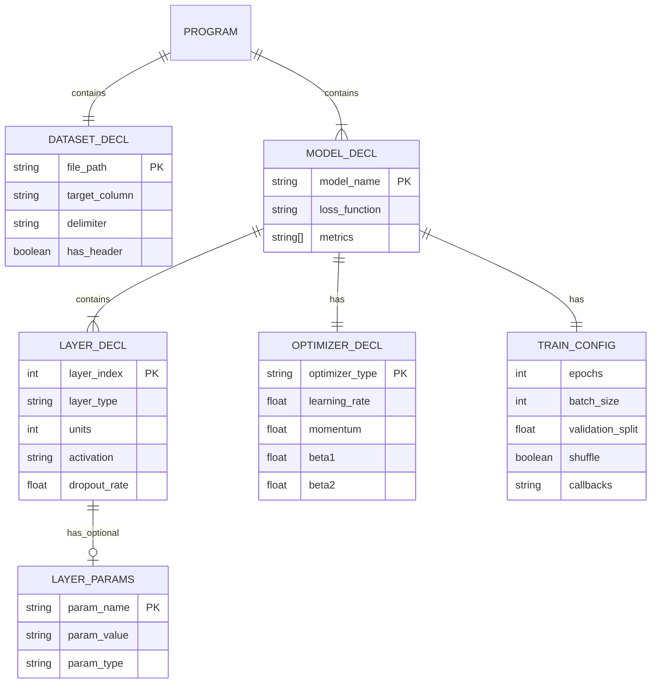

### 7.2 Internal Data Structures ERD

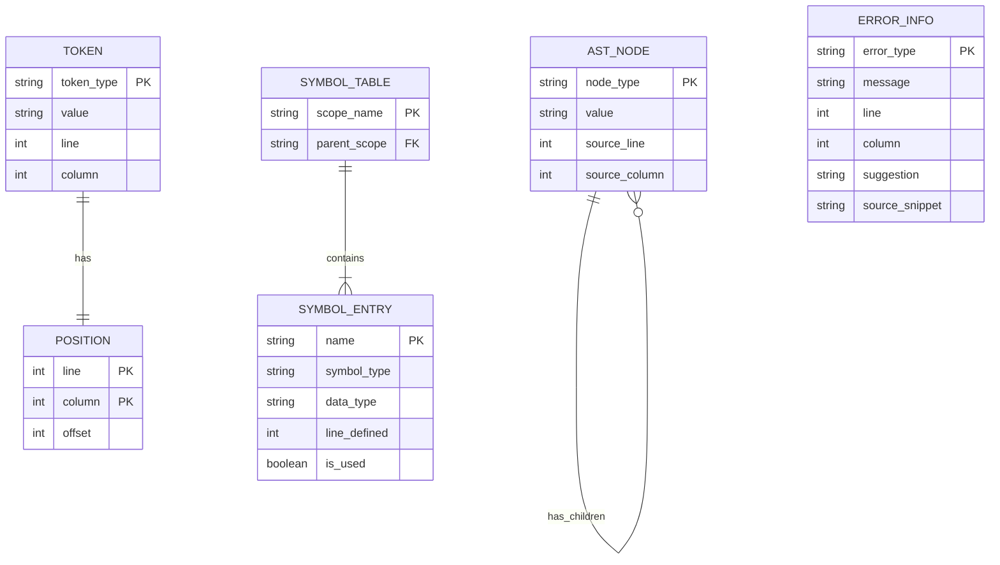

### 7.3 Compiler Pipeline Data Model

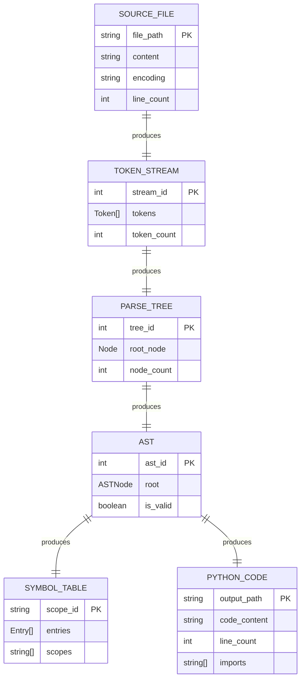

---

## 8. Arsitektur Sistem

### 8.1 System Architecture Diagram

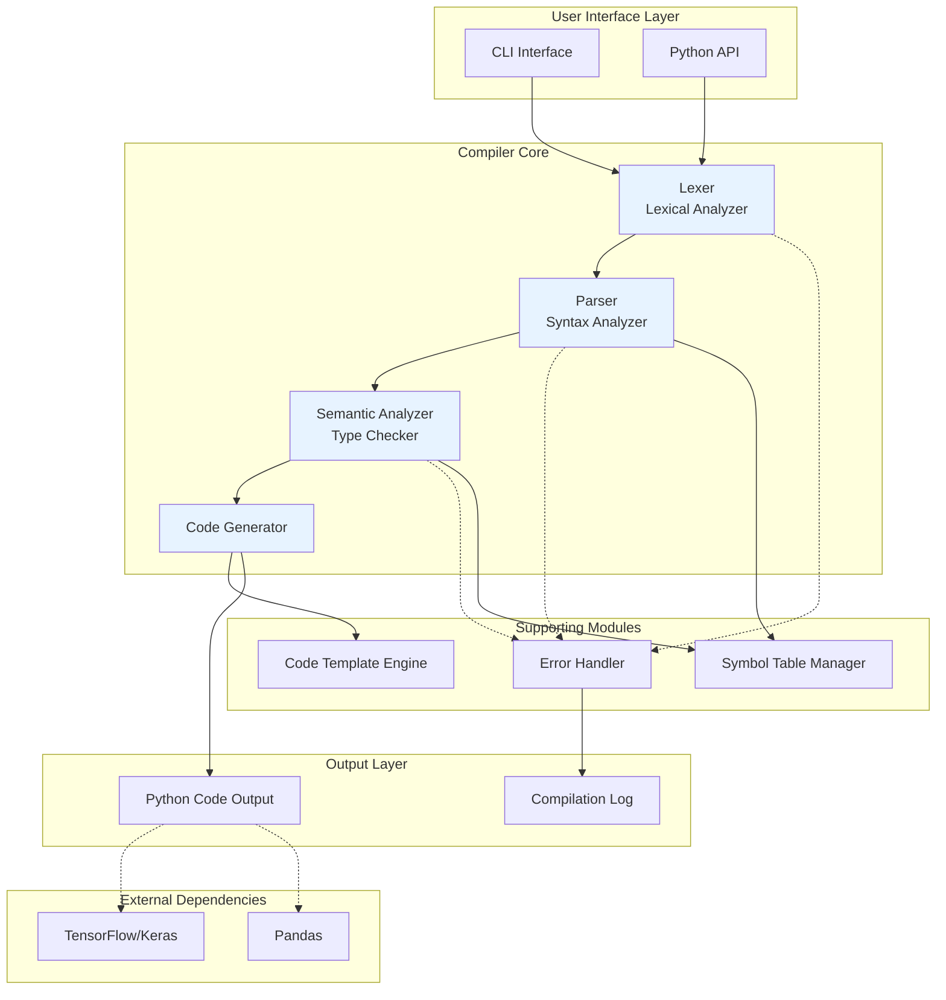

### 8.2 Component Diagram

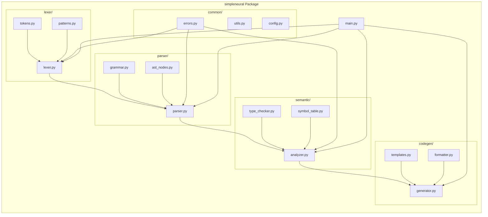

### 8.3 Sequence Diagram - Kompilasi

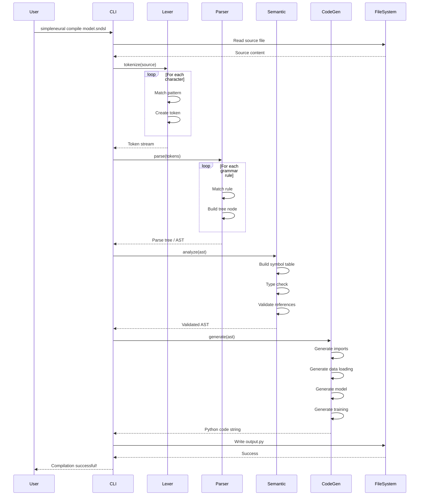

### 8.4 Data Flow Diagram

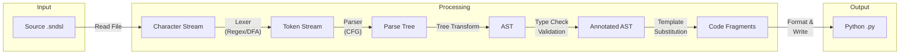

---

## 9. Deployment Architecture

### 9.1 Deployment Diagram

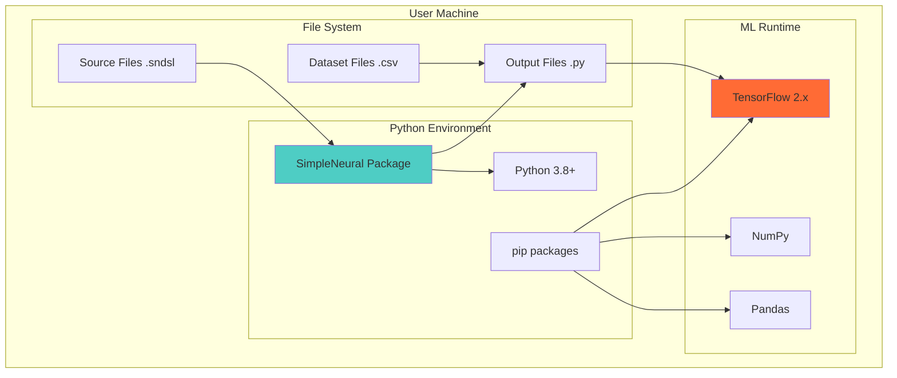

### 9.2 Package Structure

```
simpleneural/
├── __init__.py
├── __main__.py              # Entry point untuk `python -m simpleneural`
├── main.py                  # CLI interface
│
├── lexer/
│   ├── __init__.py
│   ├── lexer.py            # Main lexer class
│   ├── tokens.py           # Token type definitions
│   └── patterns.py         # Regex patterns
│
├── parser/
│   ├── __init__.py
│   ├── parser.py           # Main parser class
│   ├── grammar.py          # CFG rules definition
│   └── ast_nodes.py        # AST node classes
│
├── semantic/
│   ├── __init__.py
│   ├── analyzer.py         # Main semantic analyzer
│   ├── type_checker.py     # Type validation
│   └── symbol_table.py     # Symbol table management
│
├── codegen/
│   ├── __init__.py
│   ├── generator.py        # Main code generator
│   ├── templates.py        # Code templates
│   └── formatter.py        # Python code formatter
│
├── common/
│   ├── __init__.py
│   ├── errors.py           # Exception classes
│   ├── utils.py            # Utility functions
│   └── config.py           # Configuration
│
└── templates/
    ├── tensorflow.py.template
    ├── keras.py.template
    └── sklearn.py.template
```

---

## 10. Class Diagram

### 10.1 Core Classes

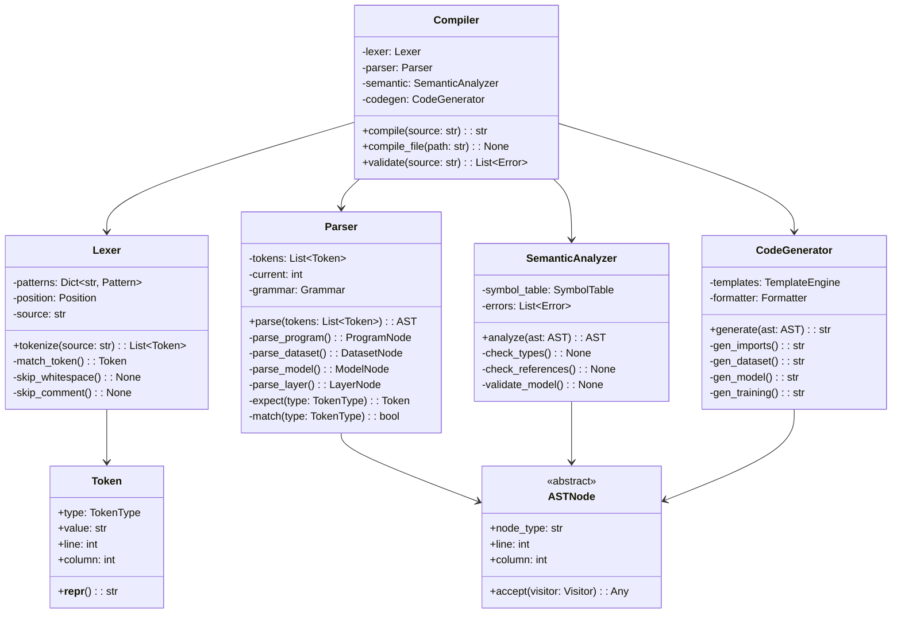

### 10.2 AST Node Hierarchy

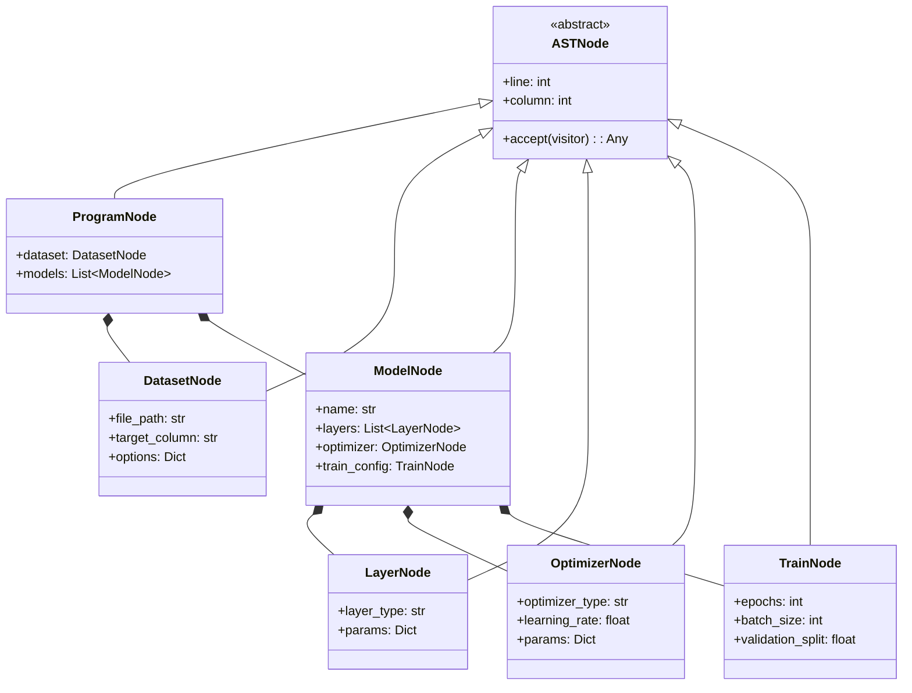

### 10.3 Error Handling Classes

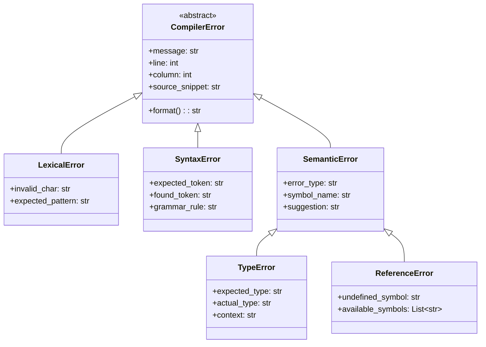

---

_Dokumen ini adalah bagian ketiga dari rancangan SimpleNeural-DSL. Lanjut ke dokumen berikutnya untuk Grammar & Token Specification._
