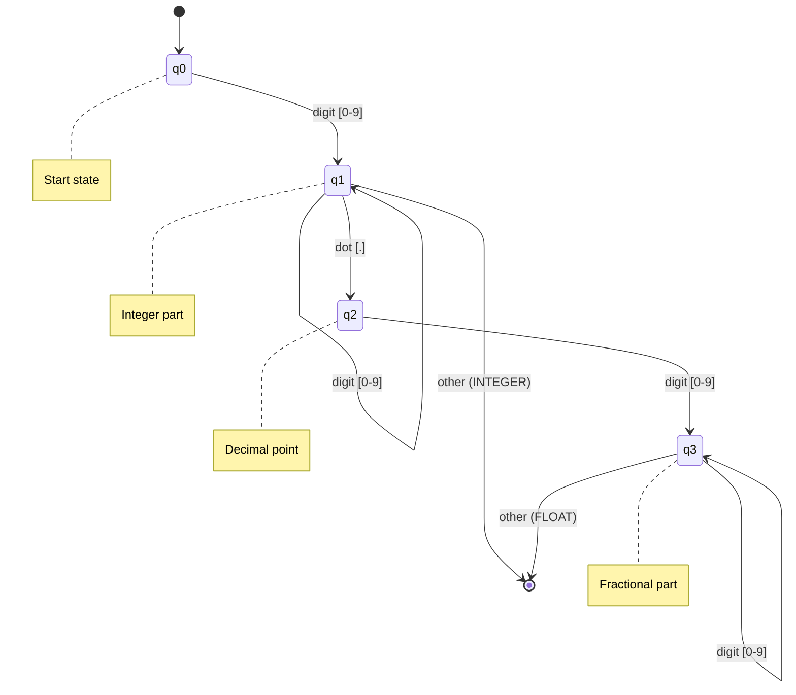
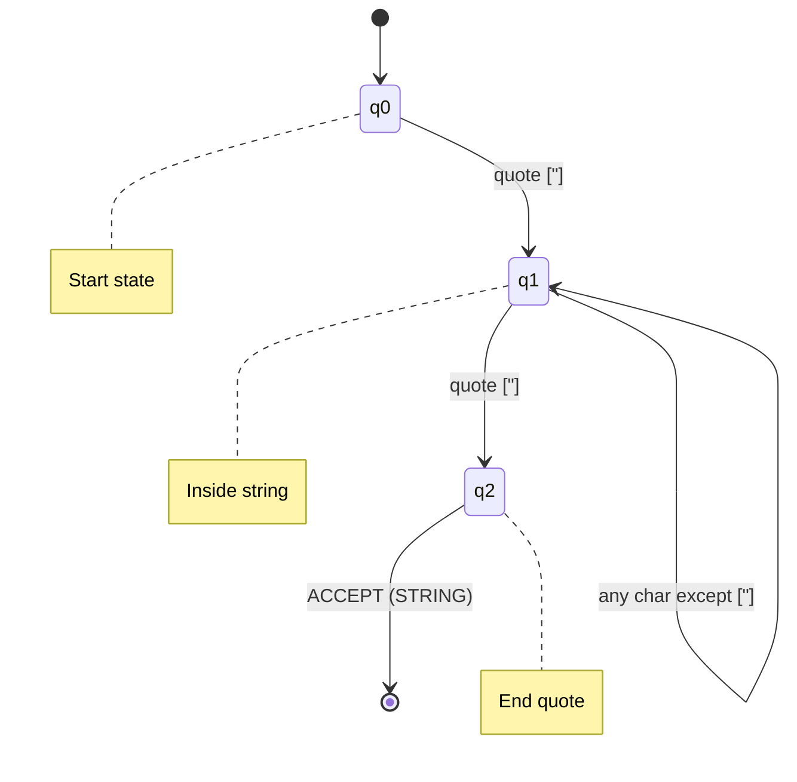
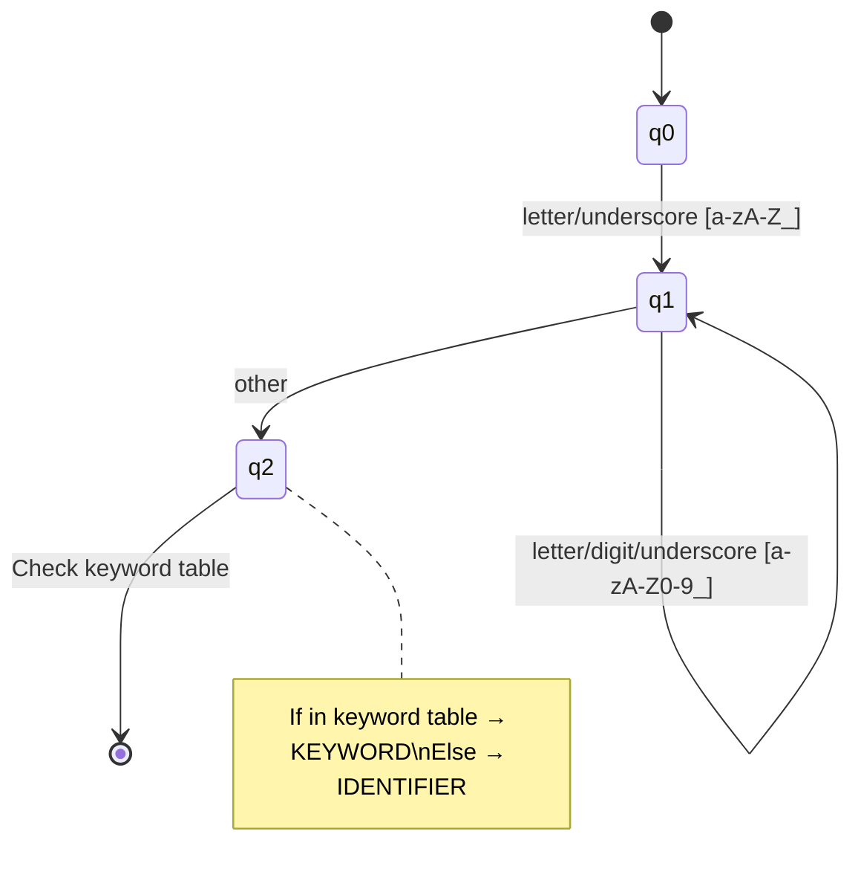
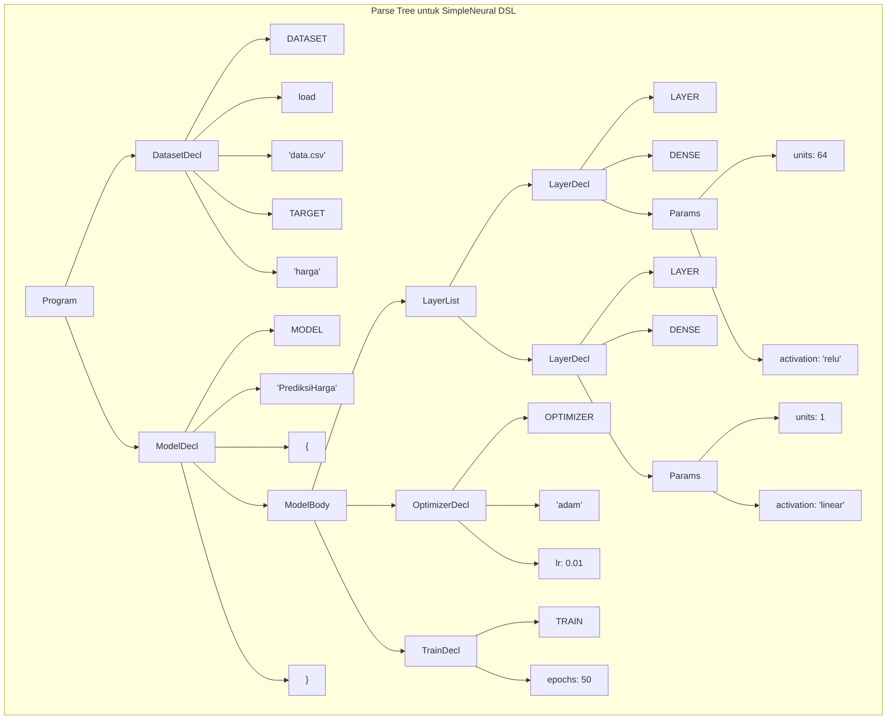

# SimpleNeural-DSL: Spesifikasi Token dan Grammar

## 11. Lexical Specification (Token Definition)

### 11.1 Token Types

SimpleNeural-DSL menggunakan token-token berikut yang dikenali oleh Lexer:

| Token Type           | Description           | Pattern (Regex)          | Example          |
| -------------------- | --------------------- | ------------------------ | ---------------- |
| `KEYWORD_DATASET`    | Deklarasi dataset     | `DATASET`                | `DATASET`        |
| `KEYWORD_MODEL`      | Deklarasi model       | `MODEL`                  | `MODEL`          |
| `KEYWORD_LAYER`      | Deklarasi layer       | `LAYER`                  | `LAYER`          |
| `KEYWORD_DENSE`      | Layer type Dense      | `DENSE`                  | `DENSE`          |
| `KEYWORD_CONV2D`     | Layer type Conv2D     | `CONV2D`                 | `CONV2D`         |
| `KEYWORD_DROPOUT`    | Layer type Dropout    | `DROPOUT`                | `DROPOUT`        |
| `KEYWORD_FLATTEN`    | Layer type Flatten    | `FLATTEN`                | `FLATTEN`        |
| `KEYWORD_OPTIMIZER`  | Konfigurasi optimizer | `OPTIMIZER`              | `OPTIMIZER`      |
| `KEYWORD_TRAIN`      | Konfigurasi training  | `TRAIN`                  | `TRAIN`          |
| `KEYWORD_LOAD`       | Load dataset          | `load`                   | `load`           |
| `KEYWORD_TARGET`     | Target column         | `TARGET`                 | `TARGET`         |
| `KEYWORD_UNITS`      | Parameter units       | `units`                  | `units`          |
| `KEYWORD_ACTIVATION` | Parameter activation  | `activation`             | `activation`     |
| `KEYWORD_LR`         | Learning rate         | `lr`                     | `lr`             |
| `KEYWORD_EPOCHS`     | Parameter epochs      | `epochs`                 | `epochs`         |
| `KEYWORD_BATCH_SIZE` | Parameter batch size  | `batch_size`             | `batch_size`     |
| `IDENTIFIER`         | Nama variabel         | `[a-zA-Z_][a-zA-Z0-9_]*` | `model_satu`     |
| `STRING`             | String literal        | `"[^"]*"`                | `"data.csv"`     |
| `INTEGER`            | Integer literal       | `[0-9]+`                 | `128`            |
| `FLOAT`              | Float literal         | `[0-9]+\.[0-9]+`         | `0.01`           |
| `LBRACE`             | Left brace            | `\{`                     | `{`              |
| `RBRACE`             | Right brace           | `\}`                     | `}`              |
| `COLON`              | Colon                 | `:`                      | `:`              |
| `COMMA`              | Comma                 | `,`                      | `,`              |
| `NEWLINE`            | Line break            | `\n`                     | -                |
| `COMMENT`            | Comment (ignored)     | `#.*`                    | `# ini komentar` |
| `WHITESPACE`         | Spaces/tabs (ignored) | `[ \t]+`                 | -                |
| `EOF`                | End of file           | -                        | -                |

### 11.2 Regular Expression Patterns

```python
# Token patterns untuk Lexer
TOKEN_PATTERNS = {
    # Keywords (harus dicek sebelum IDENTIFIER)
    'KEYWORD_DATASET':    r'\bDATASET\b',
    'KEYWORD_MODEL':      r'\bMODEL\b',
    'KEYWORD_LAYER':      r'\bLAYER\b',
    'KEYWORD_DENSE':      r'\bDENSE\b',
    'KEYWORD_CONV2D':     r'\bCONV2D\b',
    'KEYWORD_DROPOUT':    r'\bDROPOUT\b',
    'KEYWORD_FLATTEN':    r'\bFLATTEN\b',
    'KEYWORD_OPTIMIZER':  r'\bOPTIMIZER\b',
    'KEYWORD_TRAIN':      r'\bTRAIN\b',
    'KEYWORD_LOAD':       r'\bload\b',
    'KEYWORD_TARGET':     r'\bTARGET\b',
    'KEYWORD_UNITS':      r'\bunits\b',
    'KEYWORD_ACTIVATION': r'\bactivation\b',
    'KEYWORD_LR':         r'\blr\b',
    'KEYWORD_EPOCHS':     r'\bepochs\b',
    'KEYWORD_BATCH_SIZE': r'\bbatch_size\b',

    # Literals
    'FLOAT':              r'\d+\.\d+',
    'INTEGER':            r'\d+',
    'STRING':             r'"[^"]*"',

    # Identifiers
    'IDENTIFIER':         r'[a-zA-Z_][a-zA-Z0-9_]*',

    # Punctuation
    'LBRACE':             r'\{',
    'RBRACE':             r'\}',
    'COLON':              r':',
    'COMMA':              r',',

    # Ignored
    'NEWLINE':            r'\n',
    'COMMENT':            r'#[^\n]*',
    'WHITESPACE':         r'[ \t]+',
}
```

### 11.3 Finite Automaton untuk Number Recognition



**State Transition Table untuk Number:**

| State | digit [0-9] | dot [.] | other            |
| ----- | ----------- | ------- | ---------------- |
| q0    | q1          | ERROR   | ERROR            |
| q1    | q1          | q2      | ACCEPT (INTEGER) |
| q2    | q3          | ERROR   | ERROR            |
| q3    | q3          | ERROR   | ACCEPT (FLOAT)   |

### 11.4 Finite Automaton untuk String Recognition



### 11.5 Finite Automaton untuk Identifier/Keyword



---

## 12. Context-Free Grammar (CFG)

### 12.1 Grammar Rules (BNF Notation)

```bnf
<program>           ::= <dataset_decl> <model_decl>+

<dataset_decl>      ::= DATASET LOAD STRING TARGET STRING <dataset_options>?

<dataset_options>   ::= <option_item>*

<option_item>       ::= IDENTIFIER COLON <value>

<model_decl>        ::= MODEL STRING LBRACE <model_body> RBRACE

<model_body>        ::= <layer_decl>+ <optimizer_decl> <train_decl>

<layer_decl>        ::= LAYER <layer_type> <layer_params>

<layer_type>        ::= DENSE | CONV2D | DROPOUT | FLATTEN

<layer_params>      ::= <param_item>*

<param_item>        ::= IDENTIFIER COLON <value>

<optimizer_decl>    ::= OPTIMIZER STRING <optimizer_params>?

<optimizer_params>  ::= <param_item>*

<train_decl>        ::= TRAIN <train_params>

<train_params>      ::= <param_item>+

<value>             ::= STRING | INTEGER | FLOAT | IDENTIFIER
```

### 12.2 Extended Grammar Rules (EBNF Notation)

```ebnf
(* Program Structure *)
program           = dataset_decl , { model_decl } ;

(* Dataset Declaration *)
dataset_decl      = "DATASET" , "load" , string , "TARGET" , string , [ dataset_options ] ;
dataset_options   = { option_item } ;
option_item       = identifier , ":" , value ;

(* Model Declaration *)
model_decl        = "MODEL" , string , "{" , model_body , "}" ;
model_body        = layer_list , optimizer_decl , train_decl ;

(* Layer Definitions *)
layer_list        = { layer_decl } ;
layer_decl        = "LAYER" , layer_type , layer_params ;
layer_type        = "DENSE" | "CONV2D" | "DROPOUT" | "FLATTEN" | "LSTM" | "GRU" ;
layer_params      = { param_item } ;

(* Parameter Items *)
param_item        = param_name , ":" , value ;
param_name        = "units" | "activation" | "filters" | "kernel_size"
                  | "rate" | "input_shape" | identifier ;

(* Optimizer *)
optimizer_decl    = "OPTIMIZER" , string , [ optimizer_params ] ;
optimizer_params  = { param_item } ;

(* Training Configuration *)
train_decl        = "TRAIN" , train_params ;
train_params      = { param_item } ;

(* Values *)
value             = string | integer | float | identifier | array ;
array             = "(" , value , { "," , value } , ")" ;

(* Terminals *)
string            = '"' , { character } , '"' ;
integer           = digit , { digit } ;
float             = integer , "." , integer ;
identifier        = letter , { letter | digit | "_" } ;
letter            = "a" | ... | "z" | "A" | ... | "Z" | "_" ;
digit             = "0" | ... | "9" ;
character         = ? any printable character except quote ? ;
```

### 12.3 Grammar Visualization (Parse Tree Structure)



### 12.4 First and Follow Sets (untuk LL(1) Parsing)

**FIRST Sets:**

| Non-Terminal   | FIRST Set                                          |
| -------------- | -------------------------------------------------- |
| program        | { DATASET }                                        |
| dataset_decl   | { DATASET }                                        |
| model_decl     | { MODEL }                                          |
| layer_decl     | { LAYER }                                          |
| layer_type     | { DENSE, CONV2D, DROPOUT, FLATTEN, LSTM, GRU }     |
| optimizer_decl | { OPTIMIZER }                                      |
| train_decl     | { TRAIN }                                          |
| param_item     | { IDENTIFIER, units, activation, lr, epochs, ... } |
| value          | { STRING, INTEGER, FLOAT, IDENTIFIER }             |

**FOLLOW Sets:**

| Non-Terminal   | FOLLOW Set                                      |
| -------------- | ----------------------------------------------- |
| program        | { EOF }                                         |
| dataset_decl   | { MODEL }                                       |
| model_decl     | { MODEL, EOF }                                  |
| layer_decl     | { LAYER, OPTIMIZER }                            |
| layer_type     | { IDENTIFIER, LAYER, OPTIMIZER }                |
| optimizer_decl | { TRAIN }                                       |
| train_decl     | { RBRACE }                                      |
| param_item     | { IDENTIFIER, LAYER, OPTIMIZER, TRAIN, RBRACE } |
| value          | { IDENTIFIER, LAYER, OPTIMIZER, TRAIN, RBRACE } |

### 12.5 Parsing Table (LL(1))

| Non-Terminal   | DATASET                                          | MODEL                                    | LAYER                                      | DENSE              | OPTIMIZER                                | TRAIN                     | IDENTIFIER         | STRING         | INTEGER         | FLOAT         | {   | }   |
| -------------- | ------------------------------------------------ | ---------------------------------------- | ------------------------------------------ | ------------------ | ---------------------------------------- | ------------------------- | ------------------ | -------------- | --------------- | ------------- | --- | --- |
| program        | program → dataset_decl model_decl+               |                                          |                                            |                    |                                          |                           |                    |                |                 |               |     |     |
| dataset_decl   | dataset_decl → DATASET load STRING TARGET STRING |                                          |                                            |                    |                                          |                           |                    |                |                 |               |     |     |
| model_decl     |                                                  | model_decl → MODEL STRING { model_body } |                                            |                    |                                          |                           |                    |                |                 |               |     |     |
| layer_decl     |                                                  |                                          | layer_decl → LAYER layer_type layer_params |                    |                                          |                           |                    |                |                 |               |     |     |
| layer_type     |                                                  |                                          |                                            | layer_type → DENSE |                                          |                           |                    |                |                 |               |     |     |
| optimizer_decl |                                                  |                                          |                                            |                    | optimizer_decl → OPTIMIZER STRING params |                           |                    |                |                 |               |     |     |
| train_decl     |                                                  |                                          |                                            |                    |                                          | train_decl → TRAIN params |                    |                |                 |               |     |     |
| value          |                                                  |                                          |                                            |                    |                                          |                           | value → IDENTIFIER | value → STRING | value → INTEGER | value → FLOAT |     |     |

---

## 13. Semantic Rules

### 13.1 Type System

| Construct            | Expected Type | Validation Rule                                            |
| -------------------- | ------------- | ---------------------------------------------------------- |
| `units`              | Integer       | `value > 0`                                                |
| `activation`         | String        | `value ∈ {'relu', 'sigmoid', 'tanh', 'softmax', 'linear'}` |
| `lr` (learning_rate) | Float         | `0.0001 ≤ value ≤ 1.0`                                     |
| `epochs`             | Integer       | `value > 0`                                                |
| `batch_size`         | Integer       | `value > 0 && is_power_of_2(value)` (optional)             |
| `validation_split`   | Float         | `0.0 ≤ value < 1.0`                                        |
| `dropout rate`       | Float         | `0.0 ≤ value < 1.0`                                        |
| `file_path`          | String        | File exists (optional runtime check)                       |
| `optimizer_type`     | String        | `value ∈ {'adam', 'sgd', 'rmsprop', 'adagrad', 'adamw'}`   |

### 13.2 Semantic Validation Rules

```python
# Contoh Semantic Rules dalam bentuk Python-like pseudocode

SEMANTIC_RULES = {
    "layer_units_positive": {
        "target": "LayerNode.params['units']",
        "condition": "value > 0",
        "error": "Units harus berupa integer positif"
    },

    "valid_activation": {
        "target": "LayerNode.params['activation']",
        "condition": "value in VALID_ACTIVATIONS",
        "error": "Activation function tidak valid",
        "suggestion": f"Pilihan valid: {VALID_ACTIVATIONS}"
    },

    "learning_rate_range": {
        "target": "OptimizerNode.learning_rate",
        "condition": "0.0001 <= value <= 1.0",
        "error": "Learning rate di luar range valid (0.0001 - 1.0)"
    },

    "valid_optimizer": {
        "target": "OptimizerNode.optimizer_type",
        "condition": "value in VALID_OPTIMIZERS",
        "error": "Optimizer tidak dikenal",
        "suggestion": f"Pilihan valid: {VALID_OPTIMIZERS}"
    },

    "model_has_layers": {
        "target": "ModelNode.layers",
        "condition": "len(layers) >= 1",
        "error": "Model harus memiliki minimal satu layer"
    },

    "dataset_defined_before_model": {
        "target": "ProgramNode",
        "condition": "dataset_decl comes before model_decl",
        "error": "Dataset harus didefinisikan sebelum model"
    },

    "output_layer_matches_task": {
        "target": "ModelNode.layers[-1]",
        "condition": "last_layer.activation appropriate for task",
        "warning": "Aktivasi output layer mungkin tidak sesuai dengan task"
    }
}

VALID_ACTIVATIONS = ['relu', 'sigmoid', 'tanh', 'softmax', 'linear', 'selu', 'elu', 'swish']
VALID_OPTIMIZERS = ['adam', 'sgd', 'rmsprop', 'adagrad', 'adamw', 'nadam']
VALID_LOSS_FUNCTIONS = ['mse', 'mae', 'binary_crossentropy', 'categorical_crossentropy', 'sparse_categorical_crossentropy']
```

### 13.3 Symbol Table Structure

```python
# Symbol Table Entry
class SymbolEntry:
    name: str           # Nama symbol (e.g., "model_prediksi")
    symbol_type: str    # Tipe symbol: 'dataset', 'model', 'layer', 'param'
    data_type: str      # Tipe data: 'string', 'int', 'float', 'array'
    value: Any          # Nilai jika diketahui saat compile time
    line_defined: int   # Baris di mana symbol didefinisikan
    scope: str          # Scope: 'global', 'model:X', 'layer:X'
    is_used: bool       # Apakah symbol ini digunakan

# Contoh Symbol Table
SYMBOL_TABLE = {
    "global": {
        "dataset_1": SymbolEntry(
            name="dataset_1",
            symbol_type="dataset",
            data_type="Dataset",
            value={"path": "data.csv", "target": "harga"},
            line_defined=1,
            scope="global",
            is_used=True
        )
    },
    "model:PrediksiHarga": {
        "layer_0": SymbolEntry(
            name="layer_0",
            symbol_type="layer",
            data_type="DenseLayer",
            value={"units": 64, "activation": "relu"},
            line_defined=3,
            scope="model:PrediksiHarga",
            is_used=True
        ),
        "layer_1": SymbolEntry(
            name="layer_1",
            symbol_type="layer",
            data_type="DenseLayer",
            value={"units": 1, "activation": "linear"},
            line_defined=4,
            scope="model:PrediksiHarga",
            is_used=True
        )
    }
}
```

---

## 14. Error Message Specification

### 14.1 Error Categories

| Category         | Code Range | Example                 |
| ---------------- | ---------- | ----------------------- |
| Lexical Errors   | E1XX       | E101: Invalid character |
| Syntax Errors    | E2XX       | E201: Unexpected token  |
| Semantic Errors  | E3XX       | E301: Type mismatch     |
| Reference Errors | E4XX       | E401: Undefined symbol  |
| Warning          | W5XX       | W501: Unused variable   |

### 14.2 Error Message Format

```
╭─ ERROR [CODE] ───────────────────────────────────────────╮
│ File: <filename>                                          │
│ Line: <line>, Column: <column>                           │
├───────────────────────────────────────────────────────────┤
│ <source line with context>                                │
│        ^^^^ <marker pointing to error location>           │
├───────────────────────────────────────────────────────────┤
│ Message: <error description>                              │
│ Suggestion: <how to fix>                                  │
╰───────────────────────────────────────────────────────────╯
```

### 14.3 Example Error Messages

**E101 - Invalid Character:**

```
╭─ ERROR E101: Invalid Character ──────────────────────────╮
│ File: model.sndsl                                         │
│ Line: 5, Column: 23                                       │
├───────────────────────────────────────────────────────────┤
│     LAYER DENSE units: 64@                                │
│                        ^                                  │
├───────────────────────────────────────────────────────────┤
│ Message: Karakter '@' tidak valid dalam konteks ini       │
│ Suggestion: Hapus karakter '@' atau gunakan identifier    │
│             yang valid [a-zA-Z0-9_]                       │
╰───────────────────────────────────────────────────────────╯
```

**E201 - Unexpected Token:**

```
╭─ ERROR E201: Unexpected Token ───────────────────────────╮
│ File: model.sndsl                                         │
│ Line: 3, Column: 12                                       │
├───────────────────────────────────────────────────────────┤
│     LAYER DENSE units 64 activation: "relu"               │
│                 ^~~~~                                     │
├───────────────────────────────────────────────────────────┤
│ Message: Expected ':' after parameter name, found INTEGER │
│ Suggestion: Tambahkan ':' antara nama parameter dan nilai │
│             LAYER DENSE units: 64 activation: "relu"      │
╰───────────────────────────────────────────────────────────╯
```

**E301 - Type Mismatch:**

```
╭─ ERROR E301: Type Mismatch ──────────────────────────────╮
│ File: model.sndsl                                         │
│ Line: 7, Column: 22                                       │
├───────────────────────────────────────────────────────────┤
│     OPTIMIZER "adam" lr: "zero point one"                 │
│                      ~~~~~~~~~~~~~~~~~~~                  │
├───────────────────────────────────────────────────────────┤
│ Message: Parameter 'lr' mengharapkan FLOAT, mendapat      │
│          STRING                                           │
│ Suggestion: Gunakan nilai numerik untuk learning rate     │
│             lr: 0.01                                      │
╰───────────────────────────────────────────────────────────╯
```

**E302 - Value Out of Range:**

```
╭─ ERROR E302: Value Out of Range ─────────────────────────╮
│ File: model.sndsl                                         │
│ Line: 7, Column: 22                                       │
├───────────────────────────────────────────────────────────┤
│     OPTIMIZER "adam" lr: 5.0                              │
│                          ~~~                              │
├───────────────────────────────────────────────────────────┤
│ Message: Learning rate 5.0 di luar range valid            │
│          (0.0001 - 1.0)                                   │
│ Suggestion: Gunakan nilai dalam range yang valid          │
│             Contoh: lr: 0.001                             │
╰───────────────────────────────────────────────────────────╯
```

**E401 - Undefined Symbol:**

```
╭─ ERROR E401: Undefined Reference ────────────────────────╮
│ File: model.sndsl                                         │
│ Line: 8, Column: 5                                        │
├───────────────────────────────────────────────────────────┤
│     OPTIMIZER "adamw" lr: 0.01                            │
│               ^~~~~~~                                     │
├───────────────────────────────────────────────────────────┤
│ Message: Optimizer 'adamw' tidak dikenal                  │
│ Available: adam, sgd, rmsprop, adagrad                    │
│ Suggestion: Apakah maksud Anda 'adam'?                    │
╰───────────────────────────────────────────────────────────╯
```

---

_Dokumen ini adalah bagian keempat dari rancangan SimpleNeural-DSL. Lanjut ke dokumen berikutnya untuk Code Generation dan Implementasi._
