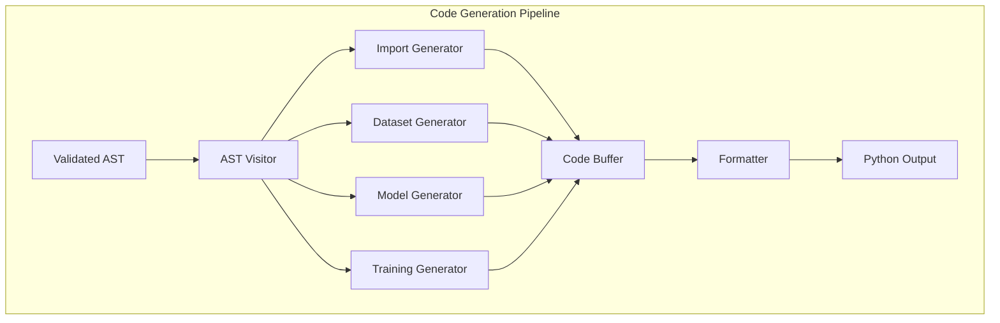

# SimpleNeural-DSL: Code Generation dan Implementasi

## 15. Code Generation

### 15.1 Code Generation Strategy

Code Generator menggunakan pendekatan **Template-Based Code Generation** dengan visitor pattern untuk traverse AST dan menghasilkan kode Python.



### 15.2 Template Mapping

#### Dataset Template

**DSL Input:**

```plaintext
DATASET load "data_harga_rumah.csv" TARGET "harga"
```

**Python Output:**

```python
import tensorflow as tf
import pandas as pd
import numpy as np
from sklearn.model_selection import train_test_split
from sklearn.preprocessing import StandardScaler

# ==================== DATA LOADING ====================
print("[INFO] Loading dataset...")
df = pd.read_csv("data_harga_rumah.csv")
y = df.pop("harga")
X = df

# Preprocessing
scaler = StandardScaler()
X_scaled = scaler.fit_transform(X)

# Train-test split
X_train, X_test, y_train, y_test = train_test_split(
    X_scaled, y, test_size=0.2, random_state=42
)
print(f"[INFO] Training samples: {len(X_train)}, Test samples: {len(X_test)}")
```

#### Model Template

**DSL Input:**

```plaintext
MODEL "PrediksiHarga" {
    LAYER DENSE units: 64 activation: "relu"
    LAYER DENSE units: 32 activation: "relu"
    LAYER DENSE units: 1 activation: "linear"
    OPTIMIZER "adam" lr: 0.01
    TRAIN epochs: 50 batch_size: 32
}
```

**Python Output:**

```python
# ==================== MODEL DEFINITION ====================
print("[INFO] Building model: PrediksiHarga")

model = tf.keras.Sequential([
    tf.keras.layers.Dense(64, activation='relu', name='layer_0'),
    tf.keras.layers.Dense(32, activation='relu', name='layer_1'),
    tf.keras.layers.Dense(1, activation='linear', name='output'),
], name='PrediksiHarga')

# Optimizer configuration
optimizer = tf.keras.optimizers.Adam(learning_rate=0.01)

# Compile model
model.compile(
    optimizer=optimizer,
    loss='mse',
    metrics=['mae']
)

# Model summary
model.summary()

# ==================== TRAINING ====================
print("[INFO] Starting training...")

history = model.fit(
    X_train, y_train,
    epochs=50,
    batch_size=32,
    validation_data=(X_test, y_test),
    verbose=1
)

# ==================== EVALUATION ====================
print("[INFO] Evaluating model...")
loss, mae = model.evaluate(X_test, y_test, verbose=0)
print(f"Test Loss (MSE): {loss:.4f}")
print(f"Test MAE: {mae:.4f}")
```

### 15.3 Layer Type Templates

| Layer Type    | DSL Syntax                                                       | Python Output                                          |
| ------------- | ---------------------------------------------------------------- | ------------------------------------------------------ |
| **DENSE**     | `LAYER DENSE units: 64 activation: "relu"`                       | `tf.keras.layers.Dense(64, activation='relu')`         |
| **CONV2D**    | `LAYER CONV2D filters: 32 kernel_size: (3,3) activation: "relu"` | `tf.keras.layers.Conv2D(32, (3,3), activation='relu')` |
| **DROPOUT**   | `LAYER DROPOUT rate: 0.5`                                        | `tf.keras.layers.Dropout(0.5)`                         |
| **FLATTEN**   | `LAYER FLATTEN`                                                  | `tf.keras.layers.Flatten()`                            |
| **LSTM**      | `LAYER LSTM units: 128 return_sequences: true`                   | `tf.keras.layers.LSTM(128, return_sequences=True)`     |
| **GRU**       | `LAYER GRU units: 64`                                            | `tf.keras.layers.GRU(64)`                              |
| **BATCHNORM** | `LAYER BATCHNORM`                                                | `tf.keras.layers.BatchNormalization()`                 |
| **MAXPOOL2D** | `LAYER MAXPOOL2D pool_size: (2,2)`                               | `tf.keras.layers.MaxPooling2D((2,2))`                  |

### 15.4 Optimizer Templates

| Optimizer   | DSL Syntax                               | Python Output                                               |
| ----------- | ---------------------------------------- | ----------------------------------------------------------- |
| **Adam**    | `OPTIMIZER "adam" lr: 0.001`             | `tf.keras.optimizers.Adam(learning_rate=0.001)`             |
| **SGD**     | `OPTIMIZER "sgd" lr: 0.01 momentum: 0.9` | `tf.keras.optimizers.SGD(learning_rate=0.01, momentum=0.9)` |
| **RMSprop** | `OPTIMIZER "rmsprop" lr: 0.001`          | `tf.keras.optimizers.RMSprop(learning_rate=0.001)`          |
| **AdaGrad** | `OPTIMIZER "adagrad" lr: 0.01`           | `tf.keras.optimizers.Adagrad(learning_rate=0.01)`           |

### 15.5 Complete Code Generation Example

**Full DSL Input (model.sndsl):**

```plaintext
# SimpleNeural DSL - House Price Prediction
# Konfigurasi untuk prediksi harga rumah

DATASET load "data_harga_rumah.csv" TARGET "harga"

MODEL "PrediksiHarga" {
    LAYER DENSE units: 64 activation: "relu"
    LAYER DROPOUT rate: 0.2
    LAYER DENSE units: 32 activation: "relu"
    LAYER DENSE units: 1 activation: "linear"

    OPTIMIZER "adam" lr: 0.01
    TRAIN epochs: 50 batch_size: 32 validation_split: 0.2
}
```

**Full Python Output (output_script.py):**

```python
#!/usr/bin/env python3
# -*- coding: utf-8 -*-
"""
Auto-generated by SimpleNeural-DSL Compiler
Source: model.sndsl
Generated: 2024-01-15 10:30:00
"""

# ==================== IMPORTS ====================
import tensorflow as tf
import pandas as pd
import numpy as np
from sklearn.model_selection import train_test_split
from sklearn.preprocessing import StandardScaler
import warnings
warnings.filterwarnings('ignore')

# Set random seed for reproducibility
tf.random.set_seed(42)
np.random.seed(42)


# ==================== DATA LOADING ====================
def load_and_preprocess_data():
    """Load dataset and perform preprocessing."""
    print("[INFO] Loading dataset: data_harga_rumah.csv")

    try:
        df = pd.read_csv("data_harga_rumah.csv")
    except FileNotFoundError:
        raise FileNotFoundError(
            "Dataset 'data_harga_rumah.csv' tidak ditemukan. "
            "Pastikan file berada di direktori yang sama."
        )

    # Separate features and target
    if "harga" not in df.columns:
        raise ValueError(
            f"Kolom target 'harga' tidak ditemukan. "
            f"Kolom yang tersedia: {list(df.columns)}"
        )

    y = df.pop("harga")
    X = df

    # Handle missing values
    if X.isnull().any().any():
        print("[WARNING] Dataset mengandung missing values. Mengisi dengan mean...")
        X = X.fillna(X.mean())

    # Feature scaling
    print("[INFO] Applying StandardScaler to features...")
    scaler = StandardScaler()
    X_scaled = scaler.fit_transform(X)

    # Train-test split
    X_train, X_test, y_train, y_test = train_test_split(
        X_scaled, y,
        test_size=0.2,
        random_state=42
    )

    print(f"[INFO] Training samples: {len(X_train)}")
    print(f"[INFO] Test samples: {len(X_test)}")
    print(f"[INFO] Number of features: {X_train.shape[1]}")

    return X_train, X_test, y_train, y_test, scaler


# ==================== MODEL DEFINITION ====================
def build_model(input_shape):
    """Build the neural network model: PrediksiHarga"""
    print("[INFO] Building model: PrediksiHarga")

    model = tf.keras.Sequential([
        tf.keras.layers.InputLayer(input_shape=(input_shape,)),
        tf.keras.layers.Dense(64, activation='relu', name='dense_0'),
        tf.keras.layers.Dropout(0.2, name='dropout_0'),
        tf.keras.layers.Dense(32, activation='relu', name='dense_1'),
        tf.keras.layers.Dense(1, activation='linear', name='output'),
    ], name='PrediksiHarga')

    # Configure optimizer
    optimizer = tf.keras.optimizers.Adam(
        learning_rate=0.01
    )

    # Compile model
    model.compile(
        optimizer=optimizer,
        loss='mse',
        metrics=['mae', 'mse']
    )

    return model


# ==================== TRAINING ====================
def train_model(model, X_train, y_train, X_test, y_test):
    """Train the model with specified parameters."""
    print("\n[INFO] Starting training...")
    print("=" * 50)

    # Callbacks
    callbacks = [
        tf.keras.callbacks.EarlyStopping(
            monitor='val_loss',
            patience=10,
            restore_best_weights=True,
            verbose=1
        ),
        tf.keras.callbacks.ReduceLROnPlateau(
            monitor='val_loss',
            factor=0.5,
            patience=5,
            min_lr=1e-6,
            verbose=1
        )
    ]

    # Training
    history = model.fit(
        X_train, y_train,
        epochs=50,
        batch_size=32,
        validation_split=0.2,
        callbacks=callbacks,
        verbose=1
    )

    return history


# ==================== EVALUATION ====================
def evaluate_model(model, X_test, y_test):
    """Evaluate model performance on test set."""
    print("\n[INFO] Evaluating model on test set...")
    print("=" * 50)

    results = model.evaluate(X_test, y_test, verbose=0)

    print(f"Test Loss (MSE): {results[0]:.4f}")
    print(f"Test MAE: {results[1]:.4f}")
    print(f"Test RMSE: {np.sqrt(results[0]):.4f}")

    # Predictions
    predictions = model.predict(X_test, verbose=0)

    # Additional metrics
    from sklearn.metrics import r2_score
    r2 = r2_score(y_test, predictions)
    print(f"R² Score: {r2:.4f}")

    return results, predictions


# ==================== MAIN ====================
def main():
    """Main execution function."""
    print("=" * 60)
    print("SimpleNeural-DSL Generated Model: PrediksiHarga")
    print("=" * 60)

    # Load data
    X_train, X_test, y_train, y_test, scaler = load_and_preprocess_data()

    # Build model
    model = build_model(input_shape=X_train.shape[1])

    # Show model summary
    print("\n[INFO] Model Architecture:")
    model.summary()

    # Train model
    history = train_model(model, X_train, y_train, X_test, y_test)

    # Evaluate model
    results, predictions = evaluate_model(model, X_test, y_test)

    # Save model (optional)
    model_path = "model_PrediksiHarga.keras"
    model.save(model_path)
    print(f"\n[INFO] Model saved to: {model_path}")

    print("\n" + "=" * 60)
    print("Training completed successfully!")
    print("=" * 60)

    return model, history, scaler


if __name__ == "__main__":
    model, history, scaler = main()
```

---

## 16. Implementasi Komponen

### 16.1 Struktur Direktori Proyek

```
simpleneural/
├── pyproject.toml              # Package configuration
├── README.md                   # Documentation
├── LICENSE                     # MIT License
│
├── simpleneural/               # Main package
│   ├── __init__.py
│   ├── __main__.py            # Entry point: python -m simpleneural
│   ├── cli.py                 # CLI interface
│   ├── compiler.py            # Main compiler orchestrator
│   │
│   ├── lexer/
│   │   ├── __init__.py
│   │   ├── lexer.py           # Lexer implementation
│   │   ├── tokens.py          # Token definitions
│   │   └── patterns.py        # Regex patterns
│   │
│   ├── parser/
│   │   ├── __init__.py
│   │   ├── parser.py          # Parser implementation
│   │   ├── grammar.py         # Grammar rules
│   │   └── ast_nodes.py       # AST node classes
│   │
│   ├── semantic/
│   │   ├── __init__.py
│   │   ├── analyzer.py        # Semantic analyzer
│   │   ├── type_checker.py    # Type checking
│   │   └── symbol_table.py    # Symbol table
│   │
│   ├── codegen/
│   │   ├── __init__.py
│   │   ├── generator.py       # Code generator
│   │   ├── templates.py       # Code templates
│   │   └── formatter.py       # Output formatter
│   │
│   └── common/
│       ├── __init__.py
│       ├── errors.py          # Error classes
│       ├── utils.py           # Utility functions
│       └── config.py          # Configuration
│
├── templates/                  # Code templates
│   ├── tensorflow.py.jinja2
│   └── sklearn.py.jinja2
│
├── examples/                   # Example DSL files
│   ├── simple_regression.sndsl
│   ├── classification.sndsl
│   └── deep_network.sndsl
│
└── tests/                      # Test suite
    ├── __init__.py
    ├── test_lexer.py
    ├── test_parser.py
    ├── test_semantic.py
    └── test_codegen.py
```

### 16.2 Pseudocode Implementasi

#### Lexer (lexer.py)

```python
"""
SimpleNeural DSL Lexer
Mengkonversi source code menjadi stream of tokens
"""
import re
from dataclasses import dataclass
from typing import List, Optional
from enum import Enum, auto


class TokenType(Enum):
    """Semua tipe token yang dikenali oleh lexer"""
    # Keywords
    DATASET = auto()
    MODEL = auto()
    LAYER = auto()
    OPTIMIZER = auto()
    TRAIN = auto()
    LOAD = auto()
    TARGET = auto()

    # Layer types
    DENSE = auto()
    CONV2D = auto()
    DROPOUT = auto()
    FLATTEN = auto()
    LSTM = auto()
    GRU = auto()

    # Parameter names
    UNITS = auto()
    ACTIVATION = auto()
    LR = auto()
    EPOCHS = auto()
    BATCH_SIZE = auto()
    RATE = auto()
    FILTERS = auto()
    KERNEL_SIZE = auto()

    # Literals
    STRING = auto()
    INTEGER = auto()
    FLOAT = auto()
    IDENTIFIER = auto()

    # Punctuation
    LBRACE = auto()
    RBRACE = auto()
    LPAREN = auto()
    RPAREN = auto()
    COLON = auto()
    COMMA = auto()

    # Special
    NEWLINE = auto()
    EOF = auto()


@dataclass
class Token:
    """Representasi single token"""
    type: TokenType
    value: str
    line: int
    column: int

    def __repr__(self):
        return f"Token({self.type.name}, '{self.value}', L{self.line}:C{self.column})"


@dataclass
class Position:
    """Posisi dalam source code"""
    line: int = 1
    column: int = 1
    offset: int = 0


class LexerError(Exception):
    """Error yang terjadi saat lexical analysis"""
    def __init__(self, message: str, line: int, column: int, char: str):
        self.message = message
        self.line = line
        self.column = column
        self.char = char
        super().__init__(self.format())

    def format(self) -> str:
        return (
            f"[LEXER ERROR] at line {self.line}, column {self.column}\n"
            f"  Invalid character: '{self.char}'\n"
            f"  {self.message}"
        )


class Lexer:
    """
    Lexical Analyzer untuk SimpleNeural DSL
    Menggunakan Finite Automaton berbasis regex
    """

    # Keyword mapping
    KEYWORDS = {
        'DATASET': TokenType.DATASET,
        'MODEL': TokenType.MODEL,
        'LAYER': TokenType.LAYER,
        'OPTIMIZER': TokenType.OPTIMIZER,
        'TRAIN': TokenType.TRAIN,
        'load': TokenType.LOAD,
        'TARGET': TokenType.TARGET,
        'DENSE': TokenType.DENSE,
        'CONV2D': TokenType.CONV2D,
        'DROPOUT': TokenType.DROPOUT,
        'FLATTEN': TokenType.FLATTEN,
        'LSTM': TokenType.LSTM,
        'GRU': TokenType.GRU,
        'units': TokenType.UNITS,
        'activation': TokenType.ACTIVATION,
        'lr': TokenType.LR,
        'epochs': TokenType.EPOCHS,
        'batch_size': TokenType.BATCH_SIZE,
        'rate': TokenType.RATE,
        'filters': TokenType.FILTERS,
        'kernel_size': TokenType.KERNEL_SIZE,
    }

    # Token patterns (order matters!)
    TOKEN_PATTERNS = [
        (r'#[^\n]*', None),                    # Comment (skip)
        (r'[ \t]+', None),                     # Whitespace (skip)
        (r'\n', TokenType.NEWLINE),            # Newline
        (r'"[^"]*"', TokenType.STRING),        # String literal
        (r'\d+\.\d+', TokenType.FLOAT),        # Float (before integer!)
        (r'\d+', TokenType.INTEGER),           # Integer
        (r'\{', TokenType.LBRACE),             # Left brace
        (r'\}', TokenType.RBRACE),             # Right brace
        (r'\(', TokenType.LPAREN),             # Left paren
        (r'\)', TokenType.RPAREN),             # Right paren
        (r':', TokenType.COLON),               # Colon
        (r',', TokenType.COMMA),               # Comma
        (r'[a-zA-Z_][a-zA-Z0-9_]*', 'IDENT'),  # Identifier/Keyword
    ]

    def __init__(self):
        self.source: str = ""
        self.pos = Position()
        self.tokens: List[Token] = []

        # Compile regex patterns
        self.patterns = [
            (re.compile(pattern), token_type)
            for pattern, token_type in self.TOKEN_PATTERNS
        ]

    def tokenize(self, source: str) -> List[Token]:
        """
        Main tokenization method
        Finite Automaton: Read → Match → Produce Token → Repeat
        """
        self.source = source
        self.pos = Position()
        self.tokens = []

        while self.pos.offset < len(self.source):
            token = self._next_token()
            if token:
                self.tokens.append(token)

        # Add EOF token
        self.tokens.append(Token(
            TokenType.EOF,
            '',
            self.pos.line,
            self.pos.column
        ))

        return self.tokens

    def _next_token(self) -> Optional[Token]:
        """Match next token using regex patterns (DFA simulation)"""
        remaining = self.source[self.pos.offset:]

        for pattern, token_type in self.patterns:
            match = pattern.match(remaining)
            if match:
                value = match.group(0)

                # Calculate position
                start_line = self.pos.line
                start_col = self.pos.column

                # Update position
                self._advance(value)

                # Skip comments and whitespace
                if token_type is None:
                    return None

                # Handle identifier/keyword
                if token_type == 'IDENT':
                    token_type = self.KEYWORDS.get(value, TokenType.IDENTIFIER)

                return Token(token_type, value, start_line, start_col)

        # No pattern matched - error!
        char = self.source[self.pos.offset]
        raise LexerError(
            "Karakter tidak dikenali",
            self.pos.line,
            self.pos.column,
            char
        )

    def _advance(self, text: str):
        """Advance position tracker"""
        for char in text:
            if char == '\n':
                self.pos.line += 1
                self.pos.column = 1
            else:
                self.pos.column += 1
            self.pos.offset += 1
```

#### Parser (parser.py)

```python
"""
SimpleNeural DSL Parser
Membangun AST dari token stream menggunakan Recursive Descent
"""
from typing import List, Optional, Dict, Any
from dataclasses import dataclass, field
from .tokens import Token, TokenType


# ==================== AST NODES ====================

@dataclass
class ASTNode:
    """Base class untuk semua AST nodes"""
    line: int
    column: int


@dataclass
class ProgramNode(ASTNode):
    """Root node - represents entire program"""
    dataset: 'DatasetNode'
    models: List['ModelNode'] = field(default_factory=list)


@dataclass
class DatasetNode(ASTNode):
    """Dataset declaration node"""
    file_path: str
    target_column: str
    options: Dict[str, Any] = field(default_factory=dict)


@dataclass
class ModelNode(ASTNode):
    """Model declaration node"""
    name: str
    layers: List['LayerNode'] = field(default_factory=list)
    optimizer: Optional['OptimizerNode'] = None
    train_config: Optional['TrainNode'] = None


@dataclass
class LayerNode(ASTNode):
    """Layer declaration node"""
    layer_type: str
    params: Dict[str, Any] = field(default_factory=dict)


@dataclass
class OptimizerNode(ASTNode):
    """Optimizer configuration node"""
    optimizer_type: str
    learning_rate: float = 0.001
    params: Dict[str, Any] = field(default_factory=dict)


@dataclass
class TrainNode(ASTNode):
    """Training configuration node"""
    epochs: int = 10
    batch_size: int = 32
    validation_split: float = 0.2
    params: Dict[str, Any] = field(default_factory=dict)


# ==================== PARSER ====================

class ParserError(Exception):
    """Syntax error during parsing"""
    def __init__(self, message: str, token: Token, expected: str = None):
        self.message = message
        self.token = token
        self.expected = expected
        super().__init__(self.format())

    def format(self) -> str:
        msg = f"[SYNTAX ERROR] at line {self.token.line}, column {self.token.column}\n"
        msg += f"  Found: {self.token.type.name} ('{self.token.value}')\n"
        if self.expected:
            msg += f"  Expected: {self.expected}\n"
        msg += f"  {self.message}"
        return msg


class Parser:
    """
    Recursive Descent Parser untuk SimpleNeural DSL
    Implementasi CFG dengan lookahead=1 (LL(1))
    """

    def __init__(self, tokens: List[Token]):
        self.tokens = tokens
        self.current = 0

    def parse(self) -> ProgramNode:
        """
        Parse entry point
        Grammar: program → dataset_decl model_decl+
        """
        # Skip leading newlines
        self._skip_newlines()

        # Parse dataset declaration
        dataset = self._parse_dataset()

        # Parse model declarations
        models = []
        while not self._is_at_end():
            self._skip_newlines()
            if self._check(TokenType.MODEL):
                models.append(self._parse_model())
            else:
                break

        if not models:
            raise ParserError(
                "Program harus memiliki minimal satu MODEL",
                self._peek(),
                "MODEL"
            )

        return ProgramNode(
            line=dataset.line,
            column=dataset.column,
            dataset=dataset,
            models=models
        )

    def _parse_dataset(self) -> DatasetNode:
        """
        Grammar: dataset_decl → DATASET load STRING TARGET STRING
        """
        token = self._expect(TokenType.DATASET)
        self._expect(TokenType.LOAD)

        file_path_token = self._expect(TokenType.STRING)
        file_path = file_path_token.value.strip('"')

        self._expect(TokenType.TARGET)

        target_token = self._expect(TokenType.STRING)
        target = target_token.value.strip('"')

        return DatasetNode(
            line=token.line,
            column=token.column,
            file_path=file_path,
            target_column=target
        )

    def _parse_model(self) -> ModelNode:
        """
        Grammar: model_decl → MODEL STRING { model_body }
        """
        token = self._expect(TokenType.MODEL)

        name_token = self._expect(TokenType.STRING)
        name = name_token.value.strip('"')

        self._expect(TokenType.LBRACE)
        self._skip_newlines()

        # Parse model body
        layers = []
        optimizer = None
        train_config = None

        while not self._check(TokenType.RBRACE):
            self._skip_newlines()

            if self._check(TokenType.LAYER):
                layers.append(self._parse_layer())
            elif self._check(TokenType.OPTIMIZER):
                optimizer = self._parse_optimizer()
            elif self._check(TokenType.TRAIN):
                train_config = self._parse_train()
            else:
                break

            self._skip_newlines()

        self._expect(TokenType.RBRACE)

        return ModelNode(
            line=token.line,
            column=token.column,
            name=name,
            layers=layers,
            optimizer=optimizer,
            train_config=train_config
        )

    def _parse_layer(self) -> LayerNode:
        """
        Grammar: layer_decl → LAYER layer_type layer_params
        """
        token = self._expect(TokenType.LAYER)

        # Layer type
        layer_type_token = self._advance()
        if layer_type_token.type not in [
            TokenType.DENSE, TokenType.CONV2D, TokenType.DROPOUT,
            TokenType.FLATTEN, TokenType.LSTM, TokenType.GRU
        ]:
            raise ParserError(
                f"Tipe layer tidak valid: {layer_type_token.value}",
                layer_type_token,
                "DENSE, CONV2D, DROPOUT, FLATTEN, LSTM, atau GRU"
            )

        layer_type = layer_type_token.value

        # Parse parameters
        params = self._parse_params()

        return LayerNode(
            line=token.line,
            column=token.column,
            layer_type=layer_type,
            params=params
        )

    def _parse_optimizer(self) -> OptimizerNode:
        """
        Grammar: optimizer_decl → OPTIMIZER STRING optimizer_params?
        """
        token = self._expect(TokenType.OPTIMIZER)

        opt_type_token = self._expect(TokenType.STRING)
        opt_type = opt_type_token.value.strip('"')

        params = self._parse_params()
        lr = params.pop('lr', 0.001)

        return OptimizerNode(
            line=token.line,
            column=token.column,
            optimizer_type=opt_type,
            learning_rate=lr,
            params=params
        )

    def _parse_train(self) -> TrainNode:
        """
        Grammar: train_decl → TRAIN train_params
        """
        token = self._expect(TokenType.TRAIN)
        params = self._parse_params()

        return TrainNode(
            line=token.line,
            column=token.column,
            epochs=params.pop('epochs', 10),
            batch_size=params.pop('batch_size', 32),
            validation_split=params.pop('validation_split', 0.2),
            params=params
        )

    def _parse_params(self) -> Dict[str, Any]:
        """
        Grammar: params → (IDENTIFIER : value)*
        """
        params = {}

        while self._check_param_name():
            name_token = self._advance()
            name = name_token.value

            self._expect(TokenType.COLON)
            value = self._parse_value()

            params[name] = value

        return params

    def _parse_value(self) -> Any:
        """
        Grammar: value → STRING | INTEGER | FLOAT | IDENTIFIER | tuple
        """
        token = self._peek()

        if token.type == TokenType.STRING:
            self._advance()
            return token.value.strip('"')
        elif token.type == TokenType.INTEGER:
            self._advance()
            return int(token.value)
        elif token.type == TokenType.FLOAT:
            self._advance()
            return float(token.value)
        elif token.type == TokenType.IDENTIFIER:
            self._advance()
            # Handle boolean-like identifiers
            if token.value.lower() == 'true':
                return True
            elif token.value.lower() == 'false':
                return False
            return token.value
        elif token.type == TokenType.LPAREN:
            return self._parse_tuple()
        else:
            raise ParserError(
                "Expected value (string, number, or identifier)",
                token
            )

    def _parse_tuple(self) -> tuple:
        """Parse tuple value like (3, 3)"""
        self._expect(TokenType.LPAREN)
        values = []

        while not self._check(TokenType.RPAREN):
            values.append(self._parse_value())
            if self._check(TokenType.COMMA):
                self._advance()

        self._expect(TokenType.RPAREN)
        return tuple(values)

    # ==================== HELPER METHODS ====================

    def _check_param_name(self) -> bool:
        """Check if current token is a valid parameter name"""
        return self._peek().type in [
            TokenType.UNITS, TokenType.ACTIVATION, TokenType.LR,
            TokenType.EPOCHS, TokenType.BATCH_SIZE, TokenType.RATE,
            TokenType.FILTERS, TokenType.KERNEL_SIZE, TokenType.IDENTIFIER
        ]

    def _expect(self, token_type: TokenType) -> Token:
        """Expect specific token type, error if not found"""
        token = self._peek()
        if token.type != token_type:
            raise ParserError(
                f"Unexpected token",
                token,
                token_type.name
            )
        return self._advance()

    def _check(self, token_type: TokenType) -> bool:
        """Check current token type without consuming"""
        return self._peek().type == token_type

    def _advance(self) -> Token:
        """Consume and return current token"""
        token = self._peek()
        if not self._is_at_end():
            self.current += 1
        return token

    def _peek(self) -> Token:
        """Look at current token without consuming"""
        return self.tokens[self.current]

    def _is_at_end(self) -> bool:
        """Check if we've reached EOF"""
        return self._peek().type == TokenType.EOF

    def _skip_newlines(self):
        """Skip all newline tokens"""
        while self._check(TokenType.NEWLINE):
            self._advance()
```

---

## 17. CLI Interface

### 17.1 CLI Commands

```bash
# Kompilasi file DSL ke Python
simpleneural compile model.sndsl

# Kompilasi dengan output path custom
simpleneural compile model.sndsl -o output.py

# Validate saja (tanpa generate)
simpleneural validate model.sndsl

# Compile dan langsung run
simpleneural run model.sndsl

# Tampilkan tokens (debug)
simpleneural tokenize model.sndsl

# Tampilkan AST (debug)
simpleneural ast model.sndsl

# Tampilkan versi
simpleneural --version

# Help
simpleneural --help
```

### 17.2 CLI Implementation

```python
"""
SimpleNeural DSL CLI
Command-line interface untuk compiler
"""
import argparse
import sys
from pathlib import Path

from .compiler import Compiler
from .lexer import Lexer
from .parser import Parser


def main():
    parser = argparse.ArgumentParser(
        prog='simpleneural',
        description='SimpleNeural DSL Compiler - Domain Specific Language untuk Konfigurasi ML'
    )

    parser.add_argument('--version', action='version', version='%(prog)s 1.0.0')

    subparsers = parser.add_subparsers(dest='command', help='Commands')

    # Compile command
    compile_parser = subparsers.add_parser('compile', help='Compile DSL to Python')
    compile_parser.add_argument('input', type=str, help='Input .sndsl file')
    compile_parser.add_argument('-o', '--output', type=str, help='Output .py file')

    # Validate command
    validate_parser = subparsers.add_parser('validate', help='Validate DSL syntax')
    validate_parser.add_argument('input', type=str, help='Input .sndsl file')

    # Run command
    run_parser = subparsers.add_parser('run', help='Compile and run')
    run_parser.add_argument('input', type=str, help='Input .sndsl file')

    # Debug commands
    tokenize_parser = subparsers.add_parser('tokenize', help='Show tokens (debug)')
    tokenize_parser.add_argument('input', type=str, help='Input .sndsl file')

    ast_parser = subparsers.add_parser('ast', help='Show AST (debug)')
    ast_parser.add_argument('input', type=str, help='Input .sndsl file')

    args = parser.parse_args()

    if args.command == 'compile':
        compile_file(args.input, args.output)
    elif args.command == 'validate':
        validate_file(args.input)
    elif args.command == 'run':
        run_file(args.input)
    elif args.command == 'tokenize':
        show_tokens(args.input)
    elif args.command == 'ast':
        show_ast(args.input)
    else:
        parser.print_help()


def compile_file(input_path: str, output_path: str = None):
    """Compile DSL file to Python"""
    try:
        compiler = Compiler()
        python_code = compiler.compile_file(input_path)

        # Determine output path
        if not output_path:
            output_path = Path(input_path).stem + '.py'

        # Write output
        with open(output_path, 'w') as f:
            f.write(python_code)

        print(f"✓ Compiled successfully: {output_path}")
        return 0

    except Exception as e:
        print(f"✗ Compilation failed:\n{e}", file=sys.stderr)
        return 1


if __name__ == '__main__':
    sys.exit(main())
```

---

_Dokumen ini adalah bagian kelima dari rancangan SimpleNeural-DSL. Lanjut ke dokumen berikutnya untuk Test Plan dan Examples._
