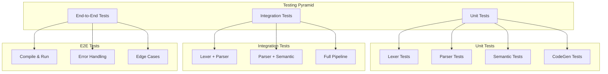

# SimpleNeural-DSL: Contoh, Test Plan, dan Rencana Verifikasi

## 18. Contoh Penggunaan (Examples)

### 18.1 Contoh 1: Regresi Sederhana (Prediksi Harga)

**File: `examples/house_price.sndsl`**

```plaintext
# ============================================
# SimpleNeural DSL - House Price Prediction
# Regresi linear dengan Neural Network
# ============================================

DATASET load "house_prices.csv" TARGET "price"

MODEL "HousePricePredictor" {
    # Hidden layers
    LAYER DENSE units: 128 activation: "relu"
    LAYER DROPOUT rate: 0.3
    LAYER DENSE units: 64 activation: "relu"
    LAYER DROPOUT rate: 0.2
    LAYER DENSE units: 32 activation: "relu"

    # Output layer (1 neuron untuk regresi)
    LAYER DENSE units: 1 activation: "linear"

    # Optimizer
    OPTIMIZER "adam" lr: 0.001

    # Training configuration
    TRAIN epochs: 100 batch_size: 32 validation_split: 0.2
}
```

**Output yang Dihasilkan:**

```python
#!/usr/bin/env python3
"""
Generated by SimpleNeural-DSL Compiler
Model: HousePricePredictor
"""

import tensorflow as tf
import pandas as pd
from sklearn.model_selection import train_test_split
from sklearn.preprocessing import StandardScaler

# Load Data
df = pd.read_csv("house_prices.csv")
y = df.pop("price")
X = df

# Preprocessing
scaler = StandardScaler()
X_scaled = scaler.fit_transform(X)
X_train, X_test, y_train, y_test = train_test_split(X_scaled, y, test_size=0.2)

# Build Model
model = tf.keras.Sequential([
    tf.keras.layers.Dense(128, activation='relu'),
    tf.keras.layers.Dropout(0.3),
    tf.keras.layers.Dense(64, activation='relu'),
    tf.keras.layers.Dropout(0.2),
    tf.keras.layers.Dense(32, activation='relu'),
    tf.keras.layers.Dense(1, activation='linear'),
], name='HousePricePredictor')

# Compile
optimizer = tf.keras.optimizers.Adam(learning_rate=0.001)
model.compile(optimizer=optimizer, loss='mse', metrics=['mae'])

# Train
history = model.fit(X_train, y_train, epochs=100, batch_size=32,
                    validation_split=0.2, verbose=1)

# Evaluate
loss, mae = model.evaluate(X_test, y_test)
print(f"Test MAE: {mae:.4f}")
```

---

### 18.2 Contoh 2: Klasifikasi Biner

**File: `examples/spam_classifier.sndsl`**

```plaintext
# ============================================
# SimpleNeural DSL - Email Spam Classifier
# Binary Classification
# ============================================

DATASET load "emails.csv" TARGET "is_spam"

MODEL "SpamClassifier" {
    # Feature extraction layers
    LAYER DENSE units: 256 activation: "relu"
    LAYER BATCHNORM
    LAYER DROPOUT rate: 0.5

    LAYER DENSE units: 128 activation: "relu"
    LAYER DROPOUT rate: 0.3

    LAYER DENSE units: 64 activation: "relu"

    # Output layer (sigmoid untuk binary classification)
    LAYER DENSE units: 1 activation: "sigmoid"

    OPTIMIZER "adam" lr: 0.0001
    TRAIN epochs: 50 batch_size: 64
}
```

---

### 18.3 Contoh 3: Klasifikasi Multi-Kelas

**File: `examples/digit_classifier.sndsl`**

```plaintext
# ============================================
# SimpleNeural DSL - Digit Classifier (MNIST-like)
# Multi-class Classification (10 classes)
# ============================================

DATASET load "digits.csv" TARGET "label"

MODEL "DigitClassifier" {
    # Flatten if needed (for 2D image data)
    LAYER FLATTEN

    # Hidden layers
    LAYER DENSE units: 512 activation: "relu"
    LAYER DROPOUT rate: 0.4
    LAYER DENSE units: 256 activation: "relu"
    LAYER DROPOUT rate: 0.3
    LAYER DENSE units: 128 activation: "relu"

    # Output layer (10 classes dengan softmax)
    LAYER DENSE units: 10 activation: "softmax"

    OPTIMIZER "adam" lr: 0.001
    TRAIN epochs: 30 batch_size: 128
}
```

---

### 18.4 Contoh 4: Convolutional Neural Network

**File: `examples/image_classifier.sndsl`**

```plaintext
# ============================================
# SimpleNeural DSL - Image Classifier
# CNN untuk klasifikasi gambar
# ============================================

DATASET load "images.csv" TARGET "category"

MODEL "ImageCNN" {
    # Convolutional layers
    LAYER CONV2D filters: 32 kernel_size: (3, 3) activation: "relu"
    LAYER MAXPOOL2D pool_size: (2, 2)

    LAYER CONV2D filters: 64 kernel_size: (3, 3) activation: "relu"
    LAYER MAXPOOL2D pool_size: (2, 2)

    LAYER CONV2D filters: 128 kernel_size: (3, 3) activation: "relu"
    LAYER MAXPOOL2D pool_size: (2, 2)

    # Flatten dan Dense
    LAYER FLATTEN
    LAYER DENSE units: 256 activation: "relu"
    LAYER DROPOUT rate: 0.5
    LAYER DENSE units: 10 activation: "softmax"

    OPTIMIZER "adam" lr: 0.0001
    TRAIN epochs: 50 batch_size: 32
}
```

---

### 18.5 Contoh 5: Sequence Model (LSTM)

**File: `examples/sentiment_analyzer.sndsl`**

```plaintext
# ============================================
# SimpleNeural DSL - Sentiment Analysis
# LSTM untuk analisis sentimen teks
# ============================================

DATASET load "reviews.csv" TARGET "sentiment"

MODEL "SentimentLSTM" {
    # Embedding would be handled by preprocessing

    # LSTM layers
    LAYER LSTM units: 128 return_sequences: true
    LAYER DROPOUT rate: 0.3
    LAYER LSTM units: 64 return_sequences: false
    LAYER DROPOUT rate: 0.2

    # Dense classification head
    LAYER DENSE units: 32 activation: "relu"
    LAYER DENSE units: 3 activation: "softmax"

    OPTIMIZER "adam" lr: 0.001
    TRAIN epochs: 20 batch_size: 64
}
```

---

## 19. Test Plan

### 19.1 Testing Strategy



### 19.2 Unit Test Cases

#### Test Suite: Lexer

| Test ID | Test Case           | Input                 | Expected Output                  |
| ------- | ------------------- | --------------------- | -------------------------------- |
| L-01    | Tokenize keywords   | `DATASET MODEL LAYER` | `[DATASET, MODEL, LAYER]` tokens |
| L-02    | Tokenize string     | `"hello world"`       | `STRING("hello world")`          |
| L-03    | Tokenize integer    | `128`                 | `INTEGER(128)`                   |
| L-04    | Tokenize float      | `0.01`                | `FLOAT(0.01)`                    |
| L-05    | Skip comments       | `# comment\nDATA`     | No comment token                 |
| L-06    | Skip whitespace     | `DATASET   MODEL`     | No whitespace tokens             |
| L-07    | Handle newlines     | `A\nB\nC`             | Track line numbers correctly     |
| L-08    | Invalid character   | `@#$`                 | `LexerError`                     |
| L-09    | Unterminated string | `"hello`              | `LexerError`                     |
| L-10    | Empty input         | ``                    | `[EOF]`                          |

```python
# Test Lexer - tests/test_lexer.py

import pytest
from simpleneural.lexer import Lexer, TokenType, LexerError


class TestLexer:
    def setup_method(self):
        self.lexer = Lexer()

    def test_tokenize_keywords(self):
        tokens = self.lexer.tokenize("DATASET MODEL LAYER")
        types = [t.type for t in tokens if t.type != TokenType.EOF]
        assert types == [TokenType.DATASET, TokenType.MODEL, TokenType.LAYER]

    def test_tokenize_string_literal(self):
        tokens = self.lexer.tokenize('"hello world"')
        assert tokens[0].type == TokenType.STRING
        assert tokens[0].value == '"hello world"'

    def test_tokenize_integer(self):
        tokens = self.lexer.tokenize("128")
        assert tokens[0].type == TokenType.INTEGER
        assert tokens[0].value == "128"

    def test_tokenize_float(self):
        tokens = self.lexer.tokenize("0.01")
        assert tokens[0].type == TokenType.FLOAT
        assert tokens[0].value == "0.01"

    def test_skip_comments(self):
        tokens = self.lexer.tokenize("# this is comment\nDATASET")
        types = [t.type for t in tokens if t.type not in [TokenType.EOF, TokenType.NEWLINE]]
        assert TokenType.DATASET in types
        # No comment token

    def test_invalid_character(self):
        with pytest.raises(LexerError):
            self.lexer.tokenize("DATASET @")

    def test_line_tracking(self):
        tokens = self.lexer.tokenize("A\nB\nC")
        # Check that line numbers are tracked
        assert tokens[0].line == 1
        # After newlines, check line increment

    def test_empty_input(self):
        tokens = self.lexer.tokenize("")
        assert len(tokens) == 1
        assert tokens[0].type == TokenType.EOF
```

#### Test Suite: Parser

| Test ID | Test Case             | Input                             | Expected Output                    |
| ------- | --------------------- | --------------------------------- | ---------------------------------- |
| P-01    | Parse minimal program | Valid DSL                         | `ProgramNode` with dataset + model |
| P-02    | Parse dataset         | `DATASET load "x.csv" TARGET "y"` | `DatasetNode`                      |
| P-03    | Parse model block     | `MODEL "X" { ... }`               | `ModelNode`                        |
| P-04    | Parse layer           | `LAYER DENSE units: 64`           | `LayerNode`                        |
| P-05    | Parse optimizer       | `OPTIMIZER "adam" lr: 0.01`       | `OptimizerNode`                    |
| P-06    | Parse train config    | `TRAIN epochs: 50`                | `TrainNode`                        |
| P-07    | Multiple layers       | 3 LAYER statements                | 3 `LayerNode` objects              |
| P-08    | Missing brace         | `MODEL "X" { `                    | `ParserError`                      |
| P-09    | Missing colon         | `units 64`                        | `ParserError`                      |
| P-10    | Invalid layer type    | `LAYER INVALID`                   | `ParserError`                      |

```python
# Test Parser - tests/test_parser.py

import pytest
from simpleneural.lexer import Lexer
from simpleneural.parser import Parser, ParserError
from simpleneural.parser.ast_nodes import (
    ProgramNode, DatasetNode, ModelNode, LayerNode
)


class TestParser:
    def parse(self, source: str):
        lexer = Lexer()
        tokens = lexer.tokenize(source)
        parser = Parser(tokens)
        return parser.parse()

    def test_parse_minimal_program(self):
        source = '''
        DATASET load "data.csv" TARGET "label"
        MODEL "Test" {
            LAYER DENSE units: 10 activation: "relu"
            OPTIMIZER "adam" lr: 0.01
            TRAIN epochs: 10
        }
        '''
        ast = self.parse(source)
        assert isinstance(ast, ProgramNode)
        assert ast.dataset is not None
        assert len(ast.models) == 1

    def test_parse_dataset(self):
        source = '''
        DATASET load "data.csv" TARGET "label"
        MODEL "Test" {
            LAYER DENSE units: 10 activation: "relu"
            OPTIMIZER "adam" lr: 0.01
            TRAIN epochs: 10
        }
        '''
        ast = self.parse(source)
        assert ast.dataset.file_path == "data.csv"
        assert ast.dataset.target_column == "label"

    def test_parse_layer(self):
        source = '''
        DATASET load "data.csv" TARGET "label"
        MODEL "Test" {
            LAYER DENSE units: 64 activation: "relu"
            OPTIMIZER "adam" lr: 0.01
            TRAIN epochs: 10
        }
        '''
        ast = self.parse(source)
        layer = ast.models[0].layers[0]
        assert layer.layer_type == "DENSE"
        assert layer.params["units"] == 64
        assert layer.params["activation"] == "relu"

    def test_parse_multiple_layers(self):
        source = '''
        DATASET load "data.csv" TARGET "label"
        MODEL "Test" {
            LAYER DENSE units: 64 activation: "relu"
            LAYER DROPOUT rate: 0.5
            LAYER DENSE units: 10 activation: "softmax"
            OPTIMIZER "adam" lr: 0.01
            TRAIN epochs: 10
        }
        '''
        ast = self.parse(source)
        assert len(ast.models[0].layers) == 3

    def test_missing_brace_error(self):
        source = '''
        DATASET load "data.csv" TARGET "label"
        MODEL "Test" {
            LAYER DENSE units: 10 activation: "relu"
        '''
        with pytest.raises(ParserError):
            self.parse(source)

    def test_invalid_layer_type_error(self):
        source = '''
        DATASET load "data.csv" TARGET "label"
        MODEL "Test" {
            LAYER INVALID units: 10
            OPTIMIZER "adam" lr: 0.01
            TRAIN epochs: 10
        }
        '''
        with pytest.raises(ParserError):
            self.parse(source)
```

#### Test Suite: Semantic Analyzer

| Test ID | Test Case          | Input               | Expected Output |
| ------- | ------------------ | ------------------- | --------------- |
| S-01    | Valid types        | All correct types   | No errors       |
| S-02    | Invalid lr type    | `lr: "text"`        | `TypeError`     |
| S-03    | Negative units     | `units: -10`        | `SemanticError` |
| S-04    | Unknown activation | `activation: "xyz"` | `SemanticError` |
| S-05    | Unknown optimizer  | `OPTIMIZER "xyz"`   | `SemanticError` |
| S-06    | No layers          | Model with 0 layers | `SemanticError` |
| S-07    | Valid range lr     | `lr: 0.5`           | No errors       |
| S-08    | Out of range lr    | `lr: 5.0`           | `SemanticError` |
| S-09    | Dropout rate > 1   | `rate: 1.5`         | `SemanticError` |
| S-10    | Reference check    | Valid references    | No errors       |

```python
# Test Semantic - tests/test_semantic.py

import pytest
from simpleneural.lexer import Lexer
from simpleneural.parser import Parser
from simpleneural.semantic import SemanticAnalyzer, SemanticError


class TestSemantic:
    def analyze(self, source: str):
        lexer = Lexer()
        tokens = lexer.tokenize(source)
        parser = Parser(tokens)
        ast = parser.parse()
        analyzer = SemanticAnalyzer()
        return analyzer.analyze(ast)

    def test_valid_program(self):
        source = '''
        DATASET load "data.csv" TARGET "label"
        MODEL "Test" {
            LAYER DENSE units: 64 activation: "relu"
            OPTIMIZER "adam" lr: 0.01
            TRAIN epochs: 10
        }
        '''
        # Should not raise
        ast = self.analyze(source)
        assert ast is not None

    def test_invalid_learning_rate_type(self):
        source = '''
        DATASET load "data.csv" TARGET "label"
        MODEL "Test" {
            LAYER DENSE units: 64 activation: "relu"
            OPTIMIZER "adam" lr: "high"
            TRAIN epochs: 10
        }
        '''
        with pytest.raises(SemanticError) as exc_info:
            self.analyze(source)
        assert "type" in str(exc_info.value).lower()

    def test_negative_units(self):
        source = '''
        DATASET load "data.csv" TARGET "label"
        MODEL "Test" {
            LAYER DENSE units: -10 activation: "relu"
            OPTIMIZER "adam" lr: 0.01
            TRAIN epochs: 10
        }
        '''
        with pytest.raises(SemanticError):
            self.analyze(source)

    def test_unknown_activation(self):
        source = '''
        DATASET load "data.csv" TARGET "label"
        MODEL "Test" {
            LAYER DENSE units: 64 activation: "unknown_func"
            OPTIMIZER "adam" lr: 0.01
            TRAIN epochs: 10
        }
        '''
        with pytest.raises(SemanticError) as exc_info:
            self.analyze(source)
        assert "activation" in str(exc_info.value).lower()

    def test_learning_rate_out_of_range(self):
        source = '''
        DATASET load "data.csv" TARGET "label"
        MODEL "Test" {
            LAYER DENSE units: 64 activation: "relu"
            OPTIMIZER "adam" lr: 5.0
            TRAIN epochs: 10
        }
        '''
        with pytest.raises(SemanticError) as exc_info:
            self.analyze(source)
        assert "range" in str(exc_info.value).lower()
```

#### Test Suite: Code Generator

| Test ID | Test Case             | Input         | Expected Output              |
| ------- | --------------------- | ------------- | ---------------------------- |
| G-01    | Generate imports      | AST           | Contains `import tensorflow` |
| G-02    | Generate dataset code | DatasetNode   | `pd.read_csv()` call         |
| G-03    | Generate model        | ModelNode     | `tf.keras.Sequential`        |
| G-04    | Generate layer        | DENSE layer   | `Dense(X, activation='Y')`   |
| G-05    | Generate optimizer    | OptimizerNode | `tf.keras.optimizers.XXX`    |
| G-06    | Generate training     | TrainNode     | `model.fit()` call           |
| G-07    | Valid Python syntax   | Full AST      | Compiles without error       |
| G-08    | Proper formatting     | Full AST      | PEP8 compliant               |
| G-09    | Executable code       | Full AST      | Runs without import errors   |
| G-10    | Comments included     | Full AST      | Contains docstrings          |

```python
# Test CodeGen - tests/test_codegen.py

import pytest
import ast as python_ast
from simpleneural.lexer import Lexer
from simpleneural.parser import Parser
from simpleneural.semantic import SemanticAnalyzer
from simpleneural.codegen import CodeGenerator


class TestCodeGenerator:
    def generate(self, source: str) -> str:
        lexer = Lexer()
        tokens = lexer.tokenize(source)
        parser = Parser(tokens)
        ast = parser.parse()
        analyzer = SemanticAnalyzer()
        validated_ast = analyzer.analyze(ast)
        generator = CodeGenerator()
        return generator.generate(validated_ast)

    def test_generates_valid_python(self):
        source = '''
        DATASET load "data.csv" TARGET "label"
        MODEL "Test" {
            LAYER DENSE units: 64 activation: "relu"
            OPTIMIZER "adam" lr: 0.01
            TRAIN epochs: 10
        }
        '''
        code = self.generate(source)
        # Should parse without SyntaxError
        python_ast.parse(code)

    def test_contains_imports(self):
        source = '''
        DATASET load "data.csv" TARGET "label"
        MODEL "Test" {
            LAYER DENSE units: 64 activation: "relu"
            OPTIMIZER "adam" lr: 0.01
            TRAIN epochs: 10
        }
        '''
        code = self.generate(source)
        assert "import tensorflow" in code
        assert "import pandas" in code

    def test_contains_model_definition(self):
        source = '''
        DATASET load "data.csv" TARGET "label"
        MODEL "MyModel" {
            LAYER DENSE units: 64 activation: "relu"
            OPTIMIZER "adam" lr: 0.01
            TRAIN epochs: 10
        }
        '''
        code = self.generate(source)
        assert "Sequential" in code or "Model" in code
        assert "Dense" in code

    def test_contains_training_call(self):
        source = '''
        DATASET load "data.csv" TARGET "label"
        MODEL "Test" {
            LAYER DENSE units: 64 activation: "relu"
            OPTIMIZER "adam" lr: 0.01
            TRAIN epochs: 50
        }
        '''
        code = self.generate(source)
        assert "fit(" in code
        assert "epochs" in code
```

### 19.3 Integration Test Cases

| Test ID | Test Case           | Description                   | Expected Result       |
| ------- | ------------------- | ----------------------------- | --------------------- |
| I-01    | Full pipeline valid | Compile valid DSL to Python   | Success, valid Python |
| I-02    | Lexer → Parser      | Token stream parsed correctly | Valid AST             |
| I-03    | Parser → Semantic   | AST validated correctly       | No semantic errors    |
| I-04    | Error propagation   | Error at lexer stops pipeline | Proper error message  |
| I-05    | Multi-model support | DSL with 2 models             | 2 model definitions   |

### 19.4 End-to-End Test Cases

| Test ID | Test Case         | Description                     | Expected Result           |
| ------- | ----------------- | ------------------------------- | ------------------------- |
| E-01    | Compile & execute | Full workflow with real data    | Model trains successfully |
| E-02    | CLI compile       | `simpleneural compile X.sndsl`  | Creates .py file          |
| E-03    | CLI validate      | `simpleneural validate X.sndsl` | Shows validation result   |
| E-04    | Error display     | Compile invalid DSL             | User-friendly error       |
| E-05    | Large file        | 100+ layers                     | Compiles within 1 second  |

---

## 20. Verification Plan

### 20.1 Automated Tests

```bash
# Run all tests
pytest tests/ -v

# Run with coverage
pytest tests/ --cov=simpleneural --cov-report=html

# Run specific test suite
pytest tests/test_lexer.py -v
pytest tests/test_parser.py -v
pytest tests/test_semantic.py -v
pytest tests/test_codegen.py -v
```

### 20.2 Manual Verification Checklist

| Checkpoint        | Description           | Criteria                                 |
| ----------------- | --------------------- | ---------------------------------------- |
| ✅ Lexer Output   | Token stream correct  | All tokens identified with correct types |
| ✅ Parser Output  | AST structure correct | Tree matches expected grammar            |
| ✅ Semantic Check | Errors detected       | Invalid configs caught                   |
| ✅ Code Output    | Python is valid       | No syntax errors                         |
| ✅ Execution      | Code runs             | Model trains without runtime errors      |
| ✅ CLI Works      | Commands function     | All subcommands work                     |
| ✅ Error Messages | Clear and actionable  | Line/column info, suggestions            |

### 20.3 Test Data

**Valid Test Files:**

- `tests/fixtures/simple_regression.sndsl`
- `tests/fixtures/classification.sndsl`
- `tests/fixtures/complex_model.sndsl`

**Invalid Test Files (for error testing):**

- `tests/fixtures/invalid_syntax.sndsl`
- `tests/fixtures/invalid_types.sndsl`
- `tests/fixtures/missing_required.sndsl`

### 20.4 Performance Benchmarks

| Metric               | Target  | Test File        |
| -------------------- | ------- | ---------------- |
| Compilation time     | < 100ms | 10 layer model   |
| Compilation time     | < 500ms | 100 layer model  |
| Memory usage         | < 50MB  | Large model      |
| Error detection time | < 50ms  | Any invalid file |

---

## 21. Deployment dan Instalasi

### 21.1 Requirements

**File: `requirements.txt`**

```text
tensorflow>=2.10.0
pandas>=1.5.0
numpy>=1.23.0
scikit-learn>=1.2.0
```

**File: `pyproject.toml`**

```toml
[build-system]
requires = ["setuptools>=61.0", "wheel"]
build-backend = "setuptools.build_meta"

[project]
name = "simpleneural"
version = "1.0.0"
description = "Domain Specific Language for ML Configuration"
readme = "README.md"
license = {text = "MIT"}
requires-python = ">=3.8"
dependencies = [
    "tensorflow>=2.10.0",
    "pandas>=1.5.0",
    "numpy>=1.23.0",
    "scikit-learn>=1.2.0",
]

[project.scripts]
simpleneural = "simpleneural.cli:main"

[tool.pytest.ini_options]
testpaths = ["tests"]
python_files = ["test_*.py"]
```

### 21.2 Installation Steps

```bash
# Clone repository
git clone https://github.com/user/simpleneural.git
cd simpleneural

# Create virtual environment
python -m venv venv
source venv/bin/activate  # Linux/Mac
# or: venv\Scripts\activate  # Windows

# Install dependencies
pip install -r requirements.txt

# Install package in development mode
pip install -e .

# Verify installation
simpleneural --version
```

### 21.3 Usage Guide

```bash
# 1. Create DSL file
cat > my_model.sndsl << 'EOF'
DATASET load "data.csv" TARGET "target"
MODEL "MyModel" {
    LAYER DENSE units: 64 activation: "relu"
    LAYER DENSE units: 1 activation: "linear"
    OPTIMIZER "adam" lr: 0.01
    TRAIN epochs: 50
}
EOF

# 2. Compile to Python
simpleneural compile my_model.sndsl -o my_model.py

# 3. Run the generated script
python my_model.py
```

---

_Dokumen ini adalah bagian keenam (terakhir) dari rancangan SimpleNeural-DSL._
