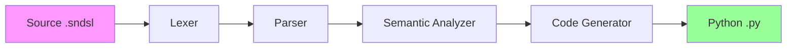

# SimpleNeural-DSL: Complete Reference Guide

## Daftar Isi

1. [Pendahuluan](./01-pendahuluan.md) - Latar belakang, tujuan, dan analisis kebutuhan
2. [Use Case Analysis](./02-use-case.md) - Diagram use case dan spesifikasi lengkap
3. [Arsitektur Sistem](./03-arsitektur.md) - ERD, system architecture, class diagrams
4. [Grammar & Token](./04-grammar-token.md) - Spesifikasi lexer, CFG, semantic rules
5. [Implementasi](./05-implementasi.md) - Code generation, pseudocode, CLI interface
6. [Testing & Examples](./06-testing-examples.md) - Test plan, contoh penggunaan, deployment

---

## Quick Reference

### Sintaks DSL

```plaintext
# Komentar
DATASET load "<file.csv>" TARGET "<column>"

MODEL "<nama_model>" {
    LAYER <TYPE> <params...>
    ...
    OPTIMIZER "<type>" lr: <float>
    TRAIN epochs: <int> batch_size: <int>
}
```

### Layer Types

| Type        | Parameters                             | Contoh                                        |
| ----------- | -------------------------------------- | --------------------------------------------- |
| `DENSE`     | `units`, `activation`                  | `LAYER DENSE units: 64 activation: "relu"`    |
| `CONV2D`    | `filters`, `kernel_size`, `activation` | `LAYER CONV2D filters: 32 kernel_size: (3,3)` |
| `DROPOUT`   | `rate`                                 | `LAYER DROPOUT rate: 0.5`                     |
| `FLATTEN`   | -                                      | `LAYER FLATTEN`                               |
| `LSTM`      | `units`, `return_sequences`            | `LAYER LSTM units: 128`                       |
| `GRU`       | `units`                                | `LAYER GRU units: 64`                         |
| `BATCHNORM` | -                                      | `LAYER BATCHNORM`                             |
| `MAXPOOL2D` | `pool_size`                            | `LAYER MAXPOOL2D pool_size: (2,2)`            |

### Activation Functions

```
relu, sigmoid, tanh, softmax, linear, selu, elu, swish
```

### Optimizers

```
adam, sgd, rmsprop, adagrad, adamw, nadam
```

### CLI Commands

```bash
# Compile
simpleneural compile <file.sndsl> [-o output.py]

# Validate only
simpleneural validate <file.sndsl>

# Compile and run
simpleneural run <file.sndsl>

# Debug
simpleneural tokenize <file.sndsl>
simpleneural ast <file.sndsl>
```

---

## Arsitektur Overview



## Komponen Automata

| Komponen | Automata/Teknik               | Penerapan                     |
| -------- | ----------------------------- | ----------------------------- |
| Lexer    | **Finite Automata (DFA/NFA)** | Pattern matching untuk tokens |
| Lexer    | **Regular Expression**        | Definisi pattern token        |
| Parser   | **Context-Free Grammar**      | Aturan sintaks bahasa         |
| Parser   | **Recursive Descent**         | Algoritma parsing LL(1)       |
| Semantic | **Symbol Table**              | Tracking scope dan tipe       |
| Semantic | **Type System**               | Validasi tipe data            |
| CodeGen  | **Template-Based**            | Transformasi AST → Python     |

---

## Contoh Lengkap

### Input (model.sndsl)

```plaintext
DATASET load "house_prices.csv" TARGET "price"

MODEL "PricePredictor" {
    LAYER DENSE units: 128 activation: "relu"
    LAYER DROPOUT rate: 0.3
    LAYER DENSE units: 64 activation: "relu"
    LAYER DENSE units: 1 activation: "linear"

    OPTIMIZER "adam" lr: 0.001
    TRAIN epochs: 100 batch_size: 32
}
```

### Output (model.py)

```python
import tensorflow as tf
import pandas as pd
from sklearn.model_selection import train_test_split
from sklearn.preprocessing import StandardScaler

# Load Data
df = pd.read_csv("house_prices.csv")
y = df.pop("price")
X = df

# Preprocessing
scaler = StandardScaler()
X_scaled = scaler.fit_transform(X)
X_train, X_test, y_train, y_test = train_test_split(X_scaled, y, test_size=0.2)

# Build Model
model = tf.keras.Sequential([
    tf.keras.layers.Dense(128, activation='relu'),
    tf.keras.layers.Dropout(0.3),
    tf.keras.layers.Dense(64, activation='relu'),
    tf.keras.layers.Dense(1, activation='linear'),
], name='PricePredictor')

# Compile
optimizer = tf.keras.optimizers.Adam(learning_rate=0.001)
model.compile(optimizer=optimizer, loss='mse', metrics=['mae'])

# Train
model.fit(X_train, y_train, epochs=100, batch_size=32, validation_split=0.2)

# Evaluate
model.evaluate(X_test, y_test)
```

---

## Struktur Proyek

```
simpleneural/
├── simpleneural/
│   ├── lexer/          # Lexical Analysis
│   ├── parser/         # Syntax Analysis + AST
│   ├── semantic/       # Semantic Analysis
│   ├── codegen/        # Code Generation
│   └── common/         # Shared utilities
├── examples/           # Contoh file DSL
├── tests/              # Test suite
└── docs/               # Dokumentasi (folder ini)
```

---

## Versi dan Lisensi

- **Versi**: 1.0.0
- **Python**: ≥ 3.8
- **TensorFlow**: ≥ 2.10
- **Lisensi**: MIT

---

_SimpleNeural-DSL - Domain Specific Language untuk Konfigurasi Eksperimen Machine Learning_
